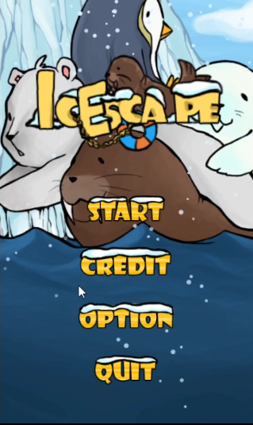
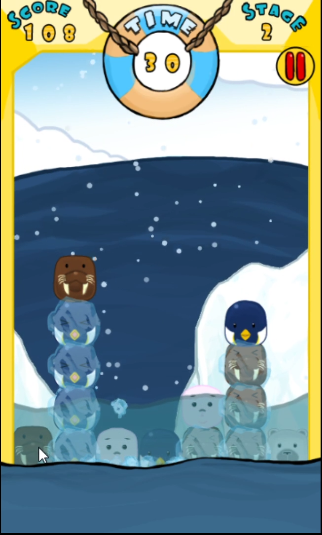
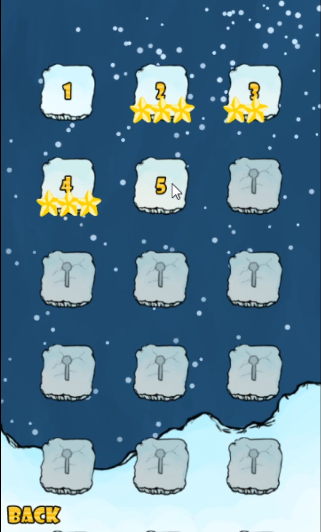
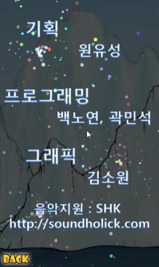

# IcEscape
|  |  |
| ---------------- | ---------------- |
|  |  |

### 한국게임과학고등학교 2학년 팀프로젝트

프로젝트 소개 : IcEscape는 지구온난화에 대한 경각심을 일깨우는 내용을 담고 있는 헥사형 블록퍼즐 게임입니다.

사용 기술 : 

C++, EM엔진(한국게임과학고등학교 교내엔진)

C++ , Cocos2d-x

C#, Xna(with cocos2d-x)

> EM엔진으로 제작이후 EM엔진의 몇가지 한계를 절감하고 Cocos2d-x 엔진으로 포팅
>
> 이후 WindowsPhone7 버전을 제작하기 위해 C#, XNA로 포팅

담당 역할 : 팀장, 프로그래밍 전체

개발기간 : 2012년 6월~ 2012년 11월

핵심 기술 / 알고리즘 : 블록 생성 및 제거 시스템. 블록 움직이기와 터트리기. 파티클 시스템. STL list 및 vector 사용 iterator로 순회. Touch began,move,end 이벤트 이해. 파일입출력 (맵 정보 및 클리어 여부, 옵션 정보 저장 및 로드).

게임 소개 : Gitbug-게임소개 및 발표자료 폴더를 참고.해주세요.

플레이 영상 : https://youtu.be/zxegM73VGtI

프로젝트 주소 : https://github.com/justkoi/IcEscape

### 핵심 코드 설명

C++ 코드 주소 : https://github.com/justkoi/IcEscape/tree/main/Cocos2d-x%20C%2B%2B/%EA%B2%8C%EC%9E%84%ED%8C%8C%EC%9D%BC(C%2B%2B%2CCocos2d-x)/HelloWorld/Classes

C# 코드 주소 : https://github.com/justkoi/IcEscape/tree/main/Cocos2d-x%20C%23/%EA%B2%8C%EC%9E%84%ED%8C%8C%EC%9D%BC(C%23%2CXNA)/HelloCocos2d/HelloCocos2d/Classes

https://github.com/justkoi/IcEscape/tree/main/Cocos2d-x%20C%23/%EA%B2%8C%EC%9E%84%ED%8C%8C%EC%9D%BC(C%23%2CXNA)/HelloCocos2d/HelloCocos2d/GameObject

#### GameScene.cpp : 게임 메인 씬으로서 블록 생성 및 제거. 블록 이동 및 드래그하여 터트리는 알고리즘을 주관합니다.

CreateBlock

ccTouchBegan

ccTouchMoved

ccTouchEnded

```c++
#include "stdafx.h"

USING_NS_CC;
int g_nScore = 0;

bool	g_bPause = false;
bool	g_bBGM_Sound = true;
bool	g_bEFFECT_Sound = true;

#define KFILTERINGFACTOR 0.1
#define KRESTACCELX -0.6
#define KSHIPMAXPOINTSPERSEC (winSize.height*0.5)    
#define KMAXDIFFX 0.2


CCScene* GameScene::scene()
{
    // 'scene' is an autorelease object
    CCScene *scene = CCScene::create();
    
    // 'layer' is an autorelease object5.
    GameScene *layer = GameScene::create();

    // add layer as a child to scene
    scene->addChild(layer);

    // return the scene
    return scene;
}
float GameScene::ReturnWidth(float fValue)
{
	fValue = fValue - 240;
	return (g_PhoneSize.width/2) + fValue;
}
float GameScene::ReturnHeight(float fValue)
{
	fValue = fValue - 400;
	return (g_PhoneSize.height/2) + fValue;
}
void GameScene::SaveStage()
{
	CCFileUtils FileUitil;
	string strTemp = "";// FileUitil.sharedFileUtils()->getWriteablePath();
	strTemp.append("stagelock.sav");
	
	string strTemp2 = "";// FileUitil.sharedFileUtils()->getWriteablePath();
	strTemp2.append("stagejudgment.sav");

	FILE* fpw = fopen(strTemp.c_str(),"wb");
	FILE* fpw2 = fopen(strTemp2.c_str(),"wb");
	
	
	for(int i=0; i<D_STAGE_MAX; i++)
	{
		fwrite(&g_bStageLock[i],sizeof(bool),1,fpw);
	}
	for(int i=0; i<D_STAGE_MAX; i++)
	{
		fwrite(&g_nScoreLevel[i],sizeof(int),1,fpw2);
	}

	fclose(fpw);
	fclose(fpw2);
}

void GameScene::LoadStage()
{
	CCFileUtils FileUitil;
	string strTemp = "";// FileUitil.sharedFileUtils()->getWriteablePath();
	strTemp.append("stagelock.sav");
	string strTemp2 = "";// FileUitil.sharedFileUtils()->getWriteablePath();
	strTemp2.append("stagejudgment.sav");
	FILE* fpr = fopen(strTemp.c_str(),"rb");
	FILE* fpr2 = fopen(strTemp2.c_str(),"rb");
	
	for(int i=0; i<D_STAGE_MAX; i++)
	{
		fread(&g_bStageLock[i],sizeof(bool),1,fpr);
	}
	
	for(int i=0; i<D_STAGE_MAX; i++)
	{
		fread(&g_nScoreLevel[i],sizeof(int),1,fpr2);
	}
	fclose(fpr);
	fclose(fpr2);
}

void GameScene::CreateBlockIt(int nX, int nY, E_BLOCKNUMBER eBlockNumber)
{
	for(int i=0; i<m_nBlockMax; i++)
	{
		if(m_BlockList[i].m_bLive == true)
			continue;

		m_BlockList[i].CreateIt(stVec2i(nX,nY),eBlockNumber);
		m_Map->m_nBlockMap[nY][nX] = 1;
		break;
	}
}

void GameScene::CreateBlock(int nX, int nY)
{
	for(int i=0; i<m_nBlockMax; i++)
	{
		if(m_BlockList[i].m_bLive == true)
			continue;

		m_BlockList[i].Create(stVec2i(nX,nY));
		m_Map->m_nBlockMap[nY][nX] = 1;
		break;
	}
}

void GameScene::CreateLine()
{
	for(int i=0; i<D_BLOCKMAP_WIDTH; i++)
	{
		CreateBlock(i,0);
	}
}

void GameScene::ReadMap(int nStage)
{
	CCFileUtils FileUitil;
	unsigned char* mFileData = NULL;
	unsigned long bufferSize = 0;
	

	

	char sFileName[256];
	int nIndex = 0;

	
	if(CC_TARGET_PLATFORM == CC_PLATFORM_ANDROID)
	{
		sprintf(sFileName,"Map/Stage%d.txt",nStage);

		mFileData = FileUitil.getFileData(sFileName,"r",&bufferSize);
		//mFileData = FileUitil.getFileDataFromZip("Map.zip",sFileName,&bufferSize);
	
		//FILE* fp = fopen(sFileName,"rt");
		for(int i=0; i<D_BLOCKMAP_HEIGHT; i++)
		{
			for(int j=0; j<D_BLOCKMAP_WIDTH; j++)
			{
				int nTemp = mFileData[nIndex];
			
				nIndex++;
				if(nTemp == 'R')
				{
					m_Map->m_nBlockMap[i][j] = 1; 
					CreateBlock(j,i);
				}
				else if(nTemp == '1')
				{
					m_Map->m_nBlockMap[i][j] = 1; 
					CreateBlockIt(j,i,(E_BLOCKNUMBER)(1 -1));
				}
				else if(nTemp == '2')
				{
					m_Map->m_nBlockMap[i][j] = 1; 
					CreateBlockIt(j,i,(E_BLOCKNUMBER)(2 -1));
				}
				else if(nTemp == '3')
				{
					m_Map->m_nBlockMap[i][j] = 1; 
					CreateBlockIt(j,i,(E_BLOCKNUMBER)(3 -1));
				}
				else if(nTemp == '4')
				{
					m_Map->m_nBlockMap[i][j] = 1; 
					CreateBlockIt(j,i,(E_BLOCKNUMBER)(4 -1));
				}
			}
			nIndex++;
			nIndex++;
			//fgetc(fp);
		}
	}
	else if(CC_TARGET_PLATFORM == CC_PLATFORM_WIN32)
	{
		sprintf(sFileName,"Stage%d.txt",nStage);

		//mFileData = FileUitil.getFileData(sFileName,"r",&bufferSize);
		mFileData = FileUitil.getFileDataFromZip("Map.zip",sFileName,&bufferSize);
	
		//FILE* fp = fopen(sFileName,"rt");
		for(int i=0; i<D_BLOCKMAP_HEIGHT; i++)
		{
			for(int j=0; j<D_BLOCKMAP_WIDTH; j++)
			{
				int nTemp = mFileData[nIndex];
			
				nIndex++;
				if(nTemp == 'R')
				{
					m_Map->m_nBlockMap[i][j] = 1; 
					CreateBlock(j,i);
				}
				else if(nTemp == '1')
				{
					m_Map->m_nBlockMap[i][j] = 1; 
					CreateBlockIt(j,i,(E_BLOCKNUMBER)(1 -1));
				}
				else if(nTemp == '2')
				{
					m_Map->m_nBlockMap[i][j] = 1; 
					CreateBlockIt(j,i,(E_BLOCKNUMBER)(2 -1));
				}
				else if(nTemp == '3')
				{
					m_Map->m_nBlockMap[i][j] = 1; 
					CreateBlockIt(j,i,(E_BLOCKNUMBER)(3 -1));
				}
				else if(nTemp == '4')
				{
					m_Map->m_nBlockMap[i][j] = 1; 
					CreateBlockIt(j,i,(E_BLOCKNUMBER)(4 -1));
				}
			}
			nIndex++;
			nIndex++;
			//fgetc(fp);
		}
	}
}
// on "init" you need to initialize your instance
bool GameScene::init()
{
	//CreateLine();
	//////////////////////////////
    // 1. super init first
    if ( !CCLayer::init() )
    {
		
        return false;
    }
	m_fUpDownTime = 0.0f;
	m_fUpDownSpeed = 0.017f;
	m_fUpDownPlusTime = 0.0f;

	m_fReadySpeed = 50.0f;

	m_bNeedDelete = false;
	m_stNeedIndex.m_nX = 0;
	m_stNeedIndex.m_nY = 0;
	fTtTiemr = 0.0f;

	m_fReadyTimer = 0.0f;
	m_nReadyFlag = 0;

	m_nStage = g_nSelectStage;

	m_bSaved = false;
	
	m_CSeaLevel.Init(this);
	m_Fish.Init(this);

	m_EffectManager.Init(this);

	m_stMoveBlockPos = CCPointZero;
	
	m_fTimeLimit = g_StageInfo[m_nStage-1].m_fTimeLimit;
	m_fErosionSpeed = g_StageInfo[m_nStage-1].m_fErosionSpeed;
	m_nErosionPlusSpeed = g_StageInfo[m_nStage-1].m_nErosionPlusSpeed;
	m_fCraeteTime = g_StageInfo[m_nStage-1].m_fCraeteTime;
	m_CSeaLevel.SetSeaLevelMax( g_StageInfo[m_nStage-1].m_fSeaLevelMax );

	m_fBlindTimer = 0.0f;
	m_fPopUpTimer = 0.0f;
	m_fIceTime = 0.0f;

	g_nScore = 0;

	m_nTtLevel = 0;
	
	m_eGameResult = E_GAMERESULT_NONE;
	m_eGameStep = E_GAMESTEP_READY;

	m_nStageStepToNext = false;

	CCSize size = CCDirector::sharedDirector()->getWinSize();
	


	m_pCreateBar = CCSprite::create("BlueBar.png");

	m_pCreateBar->setPosition( ccp( 240 * D_SCALE_WIDTH, 712  * D_SCALE_HEIGHT) );
	m_pCreateBar->setScaleX(1.0f * D_SCALE_WIDTH);
	m_pCreateBar->setScaleY(1.0f * D_SCALE_HEIGHT);


    // add the sprite as a child to this layer
    this->addChild(m_pCreateBar, 4);
    
	m_pBlind = CCSprite::create("Blind.png");
	
	m_pBlind->setPosition( ccp( 240 * D_SCALE_WIDTH, 400  * D_SCALE_HEIGHT) );
	m_pBlind->setScaleX(1.0f * D_SCALE_WIDTH);
	m_pBlind->setScaleY(1.0f * D_SCALE_HEIGHT);


	m_pBlind->setVisible(false);
	m_pBlind->setOpacity(255 * 0.7f);
    this->addChild(m_pBlind, 98);
    
	m_pWarning = CCSprite::create("Warning.png");

	m_pWarning->setPosition( ccp( 240 * D_SCALE_WIDTH, 400  * D_SCALE_HEIGHT) );
	m_pWarning->setScaleX(1.0f * D_SCALE_WIDTH);
	m_pWarning->setScaleY(1.0f * D_SCALE_HEIGHT);


	m_pWarning->setVisible(true);
	m_pWarning->setOpacity(255 * 1.0f);
    this->addChild(m_pWarning, 98);
    
	m_fWarningTimer = 0.0f;

	m_pGameOver = CCSprite::create("GameOver.png");

	m_pGameOver->setPosition( ccp( 240 * D_SCALE_WIDTH, 400  * D_SCALE_HEIGHT) );
	m_pGameOver->setScaleX(1.0f * D_SCALE_WIDTH);
	m_pGameOver->setScaleY(1.0f * D_SCALE_HEIGHT);


	m_pGameOver->setVisible(false);
	m_pGameOver->setOpacity(255 * 1.0f);
    this->addChild(m_pGameOver, 99);
    
	m_pGameClear = CCSprite::create("GameClear.png");

	m_pGameClear->setPosition( ccp( 240 * D_SCALE_WIDTH, 400  * D_SCALE_HEIGHT) );
	m_pGameClear->setScaleX(1.0f * D_SCALE_WIDTH);
	m_pGameClear->setScaleY(1.0f * D_SCALE_HEIGHT);


	m_pGameClear->setVisible(false);
	m_pGameClear->setOpacity(255 * 1.0f);
    this->addChild(m_pGameClear, 99);
   

	m_pDisplay_Ready = CCSprite::create("Display_Ready.png");

	m_pDisplay_Ready->setPosition( ccp( 240 * D_SCALE_WIDTH, 900  * D_SCALE_HEIGHT) );
	m_pDisplay_Ready->setScaleX(1.0f * D_SCALE_WIDTH);
	m_pDisplay_Ready->setScaleY(1.0f * D_SCALE_HEIGHT);


	m_pDisplay_Ready->setVisible(true);
	m_pDisplay_Ready->setOpacity(255 * 1.0f);
	m_pDisplay_Ready->setColor(ccc3(0,0,0));
    this->addChild(m_pDisplay_Ready, 98);

	m_pDisplay_Go = CCSprite::create("Display_Go.png");

	m_pDisplay_Go->setPosition( ccp( 240 * D_SCALE_WIDTH, 400  * D_SCALE_HEIGHT) );
	m_pDisplay_Go->setScaleX(1.0f * D_SCALE_WIDTH);
	m_pDisplay_Go->setScaleY(1.0f * D_SCALE_HEIGHT);


	m_pDisplay_Go->setVisible(false);
	m_pDisplay_Go->setOpacity(255 * 1.0f);
    this->addChild(m_pDisplay_Go, 98);


	for(int i=0; i<3; i++)
	{
		m_pStar[i] = CCSprite::create("Star.png");

		
		m_pStar[i]->setPosition( ccp( (210 + (80*i)) * D_SCALE_WIDTH, 310  * D_SCALE_HEIGHT) );
		m_pStar[i]->setScaleX(1.0f * D_SCALE_WIDTH);
		m_pStar[i]->setScaleY(1.0f * D_SCALE_HEIGHT);


		m_pStar[i]->setVisible(false);
		m_pStar[i]->setOpacity(255 * 0.0f);
		this->addChild(m_pStar[i], 101);
	}

    for(int i=0; i<D_MAX_TTMSG; i++)
	{
		char strTemp[256];
		sprintf(strTemp,"TtMsg_%d.png",i+1);
		m_pTtMsg[i] = CCSprite::create(strTemp);


		m_pTtMsg[i]->setPosition( ccp( (240) * D_SCALE_WIDTH, 400  * D_SCALE_HEIGHT) );
		m_pTtMsg[i]->setScaleX(1.0f * D_SCALE_WIDTH);
		m_pTtMsg[i]->setScaleY(1.0f * D_SCALE_HEIGHT);


		m_pTtMsg[i]->setVisible(false);
		this->addChild(m_pTtMsg[i], 50);
	}


	_shipPointsPerSecY = 0.0f;
	m_bFreeMove = false;
	m_eBlockAct = E_BLOCKACT_NONE;

	m_bMouseDown = false;
	m_bBlockAct = false;
	
	/*
	m_pSensNumX = CCLabelTTF::create("60", "Thonburi", 40);
	m_pSensNumX->setPosition(ccp( (240), 450));
	m_pSensNumX->setColor(ccc3(0,0,0));
	this->addChild(m_pSensNumX,40);
	
	m_pSensNumY = CCLabelTTF::create("1", "Thonburi", 34);
	m_pSensNumY->setPosition(ccp( (240) , 400));
	m_pSensNumY->setColor(ccc3(0,0,0));k
	this->addChild(m_pSensNumY,40);*/
	
	m_pNumberTimeLimit.Init(this,ccp(1.1f * D_SCALE_WIDTH,1.1f * D_SCALE_HEIGHT),0,ccp( 242 * D_SCALE_WIDTH, 705 * D_SCALE_HEIGHT),40);

	m_pNumberStage.Init(this,ccp(1.0f * D_SCALE_WIDTH,1.0f * D_SCALE_HEIGHT),g_nSelectStage,ccp( 400 * D_SCALE_WIDTH, 750 * D_SCALE_HEIGHT),40);
	
	m_pNumberScore.Init(this,ccp(1.0f * D_SCALE_WIDTH,1.0f * D_SCALE_HEIGHT),0,ccp( 73 * D_SCALE_WIDTH, 750 * D_SCALE_HEIGHT),40);

	m_pNumberLastScore.Init(this,ccp(1.5f * D_SCALE_WIDTH,1.5f * D_SCALE_HEIGHT),0,ccp( 238 * D_SCALE_WIDTH , 495 * D_SCALE_HEIGHT),103);


	m_pNumberLastScore.SetVisible(false);

	this->setTouchEnabled(true);
	this->setAccelerometerEnabled(true);
	m_fCreateTimer = 0.0f;

	m_MouseList.clear();

	m_Map = new CMap();
	m_Map->Init();

	m_nBlockMax = D_BLOCKMAP_WIDTH * D_BLOCKMAP_HEIGHT;
	//m_nBlockMax = 3;
	m_BlockList = new CBlock[m_nBlockMax];

	for(int i=0; i<m_nBlockMax; i++)
	{
		m_BlockList[i].Init(this, i);
	}

	//CreateLine();
	ReadMap(m_nStage);
	/////////////////////////////
	// 2. add a menu item with "X" image, which is clicked to quit the program
	//    you may modify it.

	char strSoundTemp[256];
	int nSound = 1; //((m_nStage-1) / 3) + 1;
	sprintf(strSoundTemp,"Game_BGM%d.mp3",nSound);

	//// 사운드 출력 ///////////////////////////////////////////
	m_Sae = CocosDenshion::SimpleAudioEngine::sharedEngine();
	m_Sae->preloadBackgroundMusic(strSoundTemp);
	m_Sae->preloadEffect("Ice.wav");
	m_Sae->preloadEffect("Button.wav");
	m_Sae->preloadEffect("WIN.mp3");
	m_Sae->preloadEffect("LOSE.mp3");
	m_Sae->preloadEffect("Warning2.mp3");
	m_Sae->preloadEffect("Erosion.mp3");
	if(g_bBGM_Sound == true)
		m_Sae->playBackgroundMusic(strSoundTemp, true);

	///////////////////////////////////////////////////////////

	// add a "close" icon to exit the progress. it's an autorelease object
	


	// add a "close" icon to exit the progress. it's an autorelease object
	pPauseItem = CCMenuItemImage::create(
										"Button_Pause_1.png",
										"Button_Pause_3.png",
										this,
										menu_selector(GameScene::PauseCallback) );
	pPauseItem->setPosition( ccp(ReturnWidth(480 - 38), ReturnHeight( 800 - 100)) );
	pPause = CCMenu::create(pPauseItem, NULL);
	pPause->setPosition( CCPointZero );
	pPause->setScaleX(1.00f * D_SCALE_WIDTH);
	pPause->setScaleY(1.00f * D_SCALE_HEIGHT);
	this->addChild(pPause, 100);
	
	pSetItem = CCMenuItemImage::create(
										"Button_SMenu_1.png",
										"Button_SMenu_3.png",
										this,
										menu_selector(GameScene::BackCallback) );
	pSetItem->setPosition( ccp(ReturnWidth(240 - 70), ReturnHeight(400)) );
	pSet = CCMenu::create(pSetItem, NULL);
	pSet->setPosition( CCPointZero );
	pSet->setScaleX(1.00f * D_SCALE_WIDTH);
	pSet->setScaleY(1.00f * D_SCALE_HEIGHT);
	this->addChild(pSet, 100);

	pResumeItem = CCMenuItemImage::create(
										"Button_Set_1.png",
										"Button_Set_3.png",
										this,
										menu_selector(GameScene::ResumeCallback) );
	pResumeItem->setPosition( ccp(ReturnWidth(330), ReturnHeight(400)) );
	pResume = CCMenu::create(pResumeItem, NULL);
	pResume->setPosition( CCPointZero );
	pResume->setScaleX(1.00f * D_SCALE_WIDTH);
	pResume->setScaleY(1.00f * D_SCALE_HEIGHT);
	this->addChild(pResume, 100);

	// add a "close" icon to exit the progress. it's an autorelease object
	//pResumeItem = CCMenuItemImage::create(
	//									"Button_Resume_1.png",
	//									"Button_Resume_3.png",
	//									this,
	//									menu_selector(GameScene::ResumeCallback) );
	//pResumeItem->setPosition(CCPointZero );

	//// create menu, it's an autorelease object
	//pResume = CCMenu::create(pResumeItem, NULL);
	//pResume->setPosition( ccp(240, 290) );
	//this->addChild(pResume, 999);


	/////////////////////////////
	// 3. add your codes below...

	// add a label shows "Hello World"
	// create and initialize a label
	//CCLabelTTF* pLabel = CCLabelTTF::create("Hello World", "Arial", 24);
	// ask director the window size

	// position the label on the center of the screen
	//pLabel->setPosition( ccp(size.width / 2, size.height - 50) );

	// add the label as a child to this layer
	//this->addChild(pLabel, 1);

	for(int i=0; i<5; i++)
	{
		//CCString::stringWithFormat(
		char strTemp[256];
		sprintf(strTemp,"Stage_%d.png",i);
		m_pBackGround[i] = CCSprite::create(strTemp);
		m_pBackGround[i]->setPosition( ccp(240 * D_SCALE_WIDTH, 400 * D_SCALE_HEIGHT) );
		m_pBackGround[i]->setScaleX(1.00f * D_SCALE_WIDTH);
		m_pBackGround[i]->setScaleY(1.00f * D_SCALE_HEIGHT);


		if(i >= 2)
		{
			this->addChild(m_pBackGround[i], 30);
		}
		else
		{
			this->addChild(m_pBackGround[i], 0);
		}
	}
    
	m_pBackGround[2]->setOpacity(255 * 1.0);

	
	this->schedule(schedule_selector(GameScene::Update), 0.0);
	
		
    m_pLoading = CCSprite::create("Loading.png");


	m_pLoading->setPosition( ccp(240 * D_SCALE_WIDTH, 400 * D_SCALE_HEIGHT) );
	m_pLoading->setScaleX(1.00f * D_SCALE_WIDTH);
	m_pLoading->setScaleY(1.00f * D_SCALE_HEIGHT);


	m_pLoading->setVisible(false);
    this->addChild(m_pLoading, 105);

	m_pPause = CCSprite::create("Pause.png");

	
	m_pPause->setPosition( ccp(240 * D_SCALE_WIDTH, 400 * D_SCALE_HEIGHT) );
	m_pPause->setScaleX(1.00f * D_SCALE_WIDTH);
	m_pPause->setScaleY(1.00f * D_SCALE_HEIGHT);


    this->addChild(m_pPause, 103);

	
	CCParticleSystem *emitter;
    emitter = CCParticleSnow::node();
    emitter->setTexture(CCTextureCache::sharedTextureCache()->addImage("Snow1.png"));
	emitter->setTotalParticles(500);
    emitter->setAutoRemoveOnFinish(true);
	emitter->setLife(6.0f);
	emitter->setLifeVar(1.0f);
    emitter->setPosition(ccp(size.width - (size.width/4), (size.height) + 50));
	emitter->setGravity(ccp(-100,-100));
    emitter->setSpeedVar(200);
	//emitter->setRotatePerSecond(10.0f);
	//emitter->setRotatePerSecondVar(20.0f);
	emitter->setScale(1.0f);
    emitter->setStartSize(10.0f);
    emitter->setEndSize(10.0f);
    emitter->setDuration(360.0f);
    emitter->setSpeed(200);
	//emitter->setEmissionRate(emitter->getTotalParticles()/emitter->getLife());
	emitter->setEmissionRate(100.0f);
	//emitter->setAngle(0.0f);
	//emitter->setAngleVar(360.0f);
    this->addChild(emitter);
/*
	for(int i=0; i<D_SLIDE_NUM_MAX; i++)
	{
		m_lfSlideNumX[i] = 0;
		m_lfSlideNumY[i] = 0;
	}
	m_lfLastTouchX = 0;
	m_lfNewTouchX = 0;
	m_lfLastTouchY = 0;
	m_lfNewTouchY = 0;*/

	m_IceChunkList.clear();
	m_fWarningTimer = 4.0f;

    return true;
}

void GameScene::menuCloseCallback(CCObject* pSender)
{
	CCDirector::sharedDirector()->end();

	#if (CC_TARGET_PLATFORM == CC_PLATFORM_IOS)
		exit(0);
	#endif
}

void GameScene::GameStartCallback(CCObject* pSender)
{
   // CCDirector::sharedDirector()->end();

}

void GameScene::BackCallback(CCObject* pSender)
{
	m_fCreateTimer = 0.0f;
	D_SCENE_CHANGE_EFFECT_L(StageMenuScene::scene());
	//CCScene *pScene = CCTransitionSlideInL::transitionWithDuration(1,MenuScene::scene(),true);
	CCDirector::sharedDirector()->replaceScene(pScene);
	if(g_bEFFECT_Sound == true) { m_Sae->playEffect("StageStart.mp3"); }
}

void GameScene::PauseCallback(CCObject* pSender)
{
	if(g_bPause == false)
	{
		g_bPause = true;
		if(g_bEFFECT_Sound == true) { m_Sae->playEffect("StageStart.mp3"); }
	}
}
void GameScene::ResumeCallback(CCObject* pSender)
{
	if(g_bPause == true)
	{
		//m_fCreateTimer = 0.0f;
		//D_SCENE_CHANGE_EFFECT_L(StageMenuScene::scene());
		////CCScene *pScene = CCTransitionSlideInL::transitionWithDuration(1,MenuScene::scene(),true);
		//CCDirector::sharedDirector()->replaceScene(pScene);
		g_bPause = false;
		if(g_bEFFECT_Sound == true) { m_Sae->playEffect("StageStart.mp3"); }
	}
}

void GameScene::registerWithTouchDispatcher()
{
	CCDirector::sharedDirector()->getTouchDispatcher()->addTargetedDelegate(this, 0, true);
}

bool GameScene::ccTouchBegan(CCTouch *pTouch, CCEvent *pEvent)
{
	if(g_bPause == false)
	{
		if(m_eGameStep == E_GAMESTEP_PLAY)
		{
			if(m_bMouseDown == false)
			{
				// 손가락이 화면에 닿을 때 실행 되는 부분
				CCPoint stPos = CCDirector::sharedDirector()->convertToGL(pTouch->locationInView());
				m_bMouseDown = true;
		
				m_lfLastTouchX = stPos.x;
				m_lfLastTouchY = stPos.y;

				m_lfNewTouchX = stPos.x;
				m_lfNewTouchY = stPos.y;
				//stEMVec2 stTemp = CEMMath::ScreenToWorld((int)stPos.m_nX,(int)stPos.m_nY);
				//if(D_WORLD->GetWinInfo().m_stRt.bottom > D_WORLD->GetWinInfo().m_stRt.right)
				//{
				//	stTemp.m_fX = (stTemp.m_fX/180) * 100;
				//	stTemp.m_fY = (stTemp.m_fY/180) * 100;
				//}
				//stTemp.m_fX = (stTemp.m_fX/205) * 100;
				//stTemp.m_fY = (stTemp.m_fY/205) * 100;
				//m_pText->SetOutPutString("마우스 좌표 (" + IntToEMString((int)stTemp.m_fX) + "," + IntToEMString((int)stTemp.m_fY) + ")");

				//CEMPlane* pTemp = AABBvsRay(stPos.m_nX,stPos.m_nY,-2);
				int nTemp = 0;
				for(nTemp = 0; nTemp < m_nBlockMax; nTemp++)
				{
					if(m_BlockList[nTemp].HitTest(stPos.x, stPos.y) == true)
					{
						int nBlock = nTemp;
	
						if( m_BlockList[nBlock].m_eBlockState != E_BLOCKSTATE_FALLING )
						{
							if( m_BlockList[nBlock].m_bFreezed == false )
							{
								m_MouseList.push_back(&m_BlockList[nBlock]);
								m_BlockList[nBlock].m_pSelect->setVisible(true);
								m_bBlockAct = true;
								if(g_bEFFECT_Sound == true)
								m_Sae->playEffect("Button.wav");
							
							}
						}
						break;
					}
				}
				if(nTemp == m_nBlockMax)
				{
					m_bBlockAct = false;
				}

				/*
				int nBlock = nTemp;
				//for(nBlock = 0; nBlock < m_nBlockMax; nBlock++)
				//{
					//if(nBlock m_BlockList[n )
					//	continue;
					if( m_BlockList[nBlock].m_eBlockState != E_BLOCKSTATE_FALLING )
					{
						if( m_BlockList[nBlock].m_bFreezed == false )
						{
							m_BlockList[nBlock].m_pSelect->setVisible(true);
							//m_MouseList.push_back((*it));
							//m_pTextNowBlock->SetOutPutString((*it)->m_pBlock->GetName());
							m_bBlockAct = true;
							//m_SoundButton = D_SOUND->Play(m_SoundButtonFp,1.0f,false);
						}
					}
				*/
				//}
				//if(nBlock == m_BlockList.end())
				//{
				//	m_bBlockAct = false;
				//	m_pTextNowBlock->SetOutPutString("선택된 블록 없음");
				//}

				//}
				//if(m_eGameStep == E_GAMESTEP_END && m_fGameEndBlind >= D_GAMEOVER_BLINDTIME)
				//{
				//	D_SCENE->ChangeSceneFade("StageMenu");
				//}
				return true;
			}
		}
		else if(m_eGameStep == E_GAMESTEP_END && m_fBlindTimer >= D_GAME_END_STAR_TIME)
		{
			D_SCENE_CHANGE_EFFECT_L(StageMenuScene::scene())
			//CCScene *pScene = CCTransitionSlideInL::transitionWithDuration(1,MenuScene::scene(),true);
			CCDirector::sharedDirector()->replaceScene(pScene);
		}
	}
}
 
void GameScene::ccTouchMoved(CCTouch *pTouch, CCEvent *pEvent)
{
	if(g_bPause == false)
	{
		if(m_eGameStep == E_GAMESTEP_PLAY)
		{
						// 손가락이 드래그 될 때 실행 되는 부분
						CCPoint stPos = CCDirector::sharedDirector()->convertToGL(pTouch->locationInView());

			
						m_lfNewTouchX = stPos.x;
						m_lfNewTouchY = stPos.y;

						//m_lfLastTouchX = stPos.x;
						//m_lfLastTouchY = stPos.y;

						//!< 이미 들어있는 놈은 검사하여 break;
						//

						if(m_bMouseDown == false)
							return;

						int nLastBlock = 0; //!< 가장 마지막 블록

						list<CBlock*>::iterator itMouseList;//!< MouseList의 iterator

						int nBlock = 0;//!< BlockList의 iterator

					/*	stEMVec2 stTemp = CEMMath::ScreenToWorld((int)stPos.m_nX,(int)stPos.m_nY);
						if(D_WORLD->GetWinInfo().m_stRt.bottom > D_WORLD->GetWinInfo().m_stRt.right)
						{
							stTemp.m_fX = (stTemp.m_fX/180) * 100;
							stTemp.m_fY = (stTemp.m_fY/180) * 100;
						}
			*/


						//CEMPlane* pTemp = AABBvsRay(stPos.m_nX,stPos.m_nY,-2);
			

						int i = 0;
						list<CBlock*>::iterator itLastBlock;//!< MouseList의 iterator
						if(m_bMouseDown == true  && m_MouseList.size() >= 1 && m_bBlockAct == true)
						{
							for(itLastBlock = m_MouseList.begin(); i < m_MouseList.size() - 1; itLastBlock++, i++)
							{
								//
							}
							nLastBlock = (*itLastBlock)->m_nId;
						}


						bool bFirstBlock = false; //!< 처음 블록과 일치


						bool bMouseBlock = false; //!< 이미 마우스블록에 들어있던 블록과 일치

						for(nBlock = 0; nBlock < m_nBlockMax; nBlock++)
						{
							if(m_BlockList[nBlock].HitTest(stPos.x, stPos.y) == true)
							{
								break;
							}
						}

						if(m_MouseList.size() >= 1)
						{
							if(m_eBlockAct == E_BLOCKACT_NONE)
							{
								if( nBlock == nLastBlock) //!< 움직이는데 처음 클릭한 블록이면 빠져나감
								{
									bFirstBlock = true;
									return;
								}
								else
								{

						
									if(nBlock < m_nBlockMax)
									{
										//for(itBlockList = m_BlockList.begin(); itBlockList != m_BlockList.end(); itBlockList++)
										//{
										//	if( pTemp == m_BlockList[nBlock].m_pBlock) //!< 처음 클릭한 블록이 아니고 인접한 블록 중 하나이면 Drag판정을 내림
										//	{
												if(m_BlockList[nBlock].m_eBlockState != E_BLOCKSTATE_FALLING)
												{
													int m_nLR = m_BlockList[nLastBlock].m_stIndex.m_nX - m_BlockList[nBlock].m_stIndex.m_nX;
													int m_nUD = m_BlockList[nLastBlock].m_stIndex.m_nY - m_BlockList[nBlock].m_stIndex.m_nY;
													//!< 블록이 인접한 것인지 Check
													if( 
														(m_nUD == 0 && m_nLR == 1) ||	//좌
														(m_nUD == 0 && m_nLR == -1) ||	//우
														(m_nUD == 1 && m_nLR == 0) ||	//상
														(m_nUD == -1 && m_nLR == 0)	//하
														)
													{
														if(m_bFreeMove == true)
														{
															m_eBlockAct = E_BLOCKACT_NOT;
														}
														if(m_BlockList[nLastBlock].m_eBlockNumber == m_BlockList[nBlock].m_eBlockNumber)//!< 같은 종류인지 Check
														{
															if(m_BlockList[nBlock].m_bFreezed == false)//!< 얼어있는 녀석인지
															{
																m_BlockList[nBlock].m_pSelect->setVisible(true);
																
																m_MouseList.push_back(&m_BlockList[nBlock]);
																//m_pTextNowBlock->SetOutPutString(m_BlockList[nBlock]->m_pBlock->GetName());
																m_eBlockAct = E_BLOCKACT_DRAG;
																if(g_bEFFECT_Sound == true)
																m_Sae->playEffect("Button.wav");
																//m_SoundButton = D_SOUND->Play(m_SoundButtonFp,1.0f,false);
																//break;
															}
														}
													}
												}
											//}
										}
										if(nBlock >= m_nBlockMax && m_eBlockAct != E_BLOCKACT_NOT) //!< 인접한 블록이 아닐경우 Move판정
										{
											
											char frameName[256];
											sprintf(frameName, "Block_%d_1.png",(int)m_BlockList[nLastBlock].m_eBlockNumber+1);
											m_pGhost = CCSprite::create(frameName);
											m_pGhost->setPosition( ccp( (m_BlockList[nLastBlock].m_stPos.x - 6.4f) * D_SCALE_WIDTH, (m_BlockList[nLastBlock].m_stPos.y - 6.4f)* D_SCALE_HEIGHT) );
											m_pGhost->setAnchorPoint(ccp(0.0,0.0));
											m_pGhost->setScaleX(1.2f * D_SCALE_WIDTH);
											m_pGhost->setScaleY(1.2f * D_SCALE_HEIGHT);
											m_pGhost->setOpacity(255 * 0.5f);
											m_pGhost->setVisible(true);
											this->addChild(m_pGhost, 26);

											m_bNeedDelete = true;
											m_stNeedIndex = m_BlockList[nLastBlock].m_stIndex;

											//if(m_BlockList[nBlock].m_eBlockState != E_BLOCKSTATE_FALLING)
											//{
											m_BlockList[nLastBlock].m_pSelect->setVisible(true);
											//m_MouseList.push_back((*itLastBlock));
											m_BlockList[nLastBlock].m_bDraged = true;
											m_stMoveBlockPos = m_BlockList[nLastBlock].m_stPos;
											m_eBlockAct = E_BLOCKACT_MOVE;
											

											//}
										}
									}
							}	
						
							else if(m_eBlockAct == E_BLOCKACT_DRAG)
							{
							/*	for(nBlock = 0; nBlock < m_nBlockMax; nBlock++)
								{
									if(m_BlockList[nBlock].HitTest(stPos.x, stPos.y) == true)
									{
										break;
									}
								}*/
								for(itMouseList = m_MouseList.begin(); itMouseList != m_MouseList.end(); itMouseList++)
								{
									if(nBlock == (*itMouseList)->m_nId)
									{
										bMouseBlock = true;
										return;
									}
								}

								if(bMouseBlock == false) //!< 이미 들어있는 블록이 아닐경우
								{
									//for(itBlockList = m_BlockList.begin(); itBlockList != m_BlockList.end(); itBlockList++)
									//{
										//if( pTemp == m_BlockList[nBlock].m_pBlock) //!< 처음 클릭한 블록이 아니고 인접한 블록 중 하나이면 Drag판정을 내림
										//{
											int m_nLR = m_BlockList[nLastBlock].m_stIndex.m_nX - m_BlockList[nBlock].m_stIndex.m_nX;
											int m_nUD = m_BlockList[nLastBlock].m_stIndex.m_nY - m_BlockList[nBlock].m_stIndex.m_nY;
											//!< 블록이 인접한 것인지 Check
											if( 
												(m_nUD == 0 && m_nLR == 1) ||	//좌
												(m_nUD == 0 && m_nLR == -1) ||	//우
												(m_nUD == 1 && m_nLR == 0) ||	//상
												(m_nUD == -1 && m_nLR == 0)	//하
												)
											{
												if(m_BlockList[nLastBlock].m_eBlockNumber == m_BlockList[nBlock].m_eBlockNumber)//!< 같은 종류인지 Check
												{
													if(m_BlockList[nBlock].m_bFreezed == false)//!< 얼어있는 녀석인지
													{
														m_BlockList[nBlock].m_pSelect->setVisible(true);
														m_MouseList.push_back(&m_BlockList[nBlock]);
														if(g_bEFFECT_Sound == true)
														m_Sae->playEffect("Button.wav");
														//m_pTextNowBlock->SetOutPutString(m_BlockList[nBlock].m_pBlock->GetName());
														//m_SoundButton = D_SOUND->Play(m_SoundButtonFp,1.0f,false);
													}
												}
											}
										//}
									//}
								}
							}
							else if(m_eBlockAct == E_BLOCKACT_MOVE)
							{
								//stEMVec2 stLastBlockPos;

								//int nIndex_X = ((stPos.x - D_LINE_START_X)/D_BLOCK_WIDTH);
								//int nIndex_Y = ((D_LINE_START_Y - stPos.y)/D_BLOCK_HEIGHT);

								//stLastBlockPos = m_BlockList[nLastBlock].m_stPos;
								list<CBlock*>::iterator itr = m_MouseList.begin();

								(*itr)->m_stPos.x = (stPos.x / D_SCALE_WIDTH) - (D_BLOCK_WIDTH/2) ;
								(*itr)->m_stPos.y = (stPos.y / D_SCALE_HEIGHT) - (D_BLOCK_HEIGHT/2) ;

								//list<CEMBlock*>::iterator itBlockList;
								//for(itBlockList = m_BlockList.begin(); itBlockList != m_BlockList.end(); itBlockList++)
								//{
								//	if((*itLastBlock) == (*itBlockList))
								//		continue;

									/*if( 
									CEMMath::Abs<float>(m_BlockList[nLastBlock].m_stPos.m_fX - m_BlockList[nBlock].m_stPos.m_fX) <= D_BLOCK_WIDTH &&
									CEMMath::Abs<float>(m_BlockList[nLastBlock].m_stPos.m_fY - m_BlockList[nBlock].m_stPos.m_fY) <= D_BLOCK_HEIGHT )
									{
										if(stTemp.m_fY < m_BlockList[nBlock].m_stPos.m_fY)
										{
											m_BlockList[nLastBlock].m_stPos.m_fY = stLastBlockPos.m_fY;
										}
										break;
									}*/

								//}


								//if( m_Map->m_nBlockMap[nIndex_Y][nIndex_X] == 0)
								//{
								//	m_Map->m_nBlockMap[m_BlockList[nLastBlock].m_stIndex.m_fY][m_BlockList[nLastBlock].m_stIndex.m_fX] = 0;
								//	m_Map->m_nBlockMap[nIndex_Y][nIndex_X] = 1;
								//	m_BlockList[nLastBlock].m_stIndex.m_fX = nIndex_X;
								//	m_BlockList[nLastBlock].m_stIndex.m_fY = nIndex_Y;


								// (*itLastBlock)->m_stPos.m_fX = D_LINE_START_X + (nIndex_X * D_BLOCK_WIDTH);
								// (*itLastBlock)->m_stPos.m_fY = D_LINE_START_Y - (nIndex_Y * D_BLOCK_HEIGHT);
								//}
							}
						}

			}
	}
		
}
 
void GameScene::ccTouchEnded(CCTouch *pTouch, CCEvent *pEvent)
{
	
		if(g_bPause == false)
		{
			if(m_eGameStep == E_GAMESTEP_PLAY)
				{

				if(m_bMouseDown == true)
				{
					for(int i=0; i<D_SLIDE_NUM_MAX; i++)
					{
						m_lfSlideNumX[i] = 0;
						m_lfSlideNumY[i] = 0;
					}
					m_lfLastTouchX = 0;
					m_lfNewTouchX = 0;
					m_lfLastTouchY = 0;
					m_lfNewTouchY = 0;

					// 손가락이 화면 밖에 나가거나 , 떨때 실행되는 부분
					CCPoint stPos = CCDirector::sharedDirector()->convertToGL(pTouch->locationInView());

						/*int nBlock = 0;
						for(nBlock = 0; nBlock < m_nBlockMax; nBlock++)
						{
							m_BlockList[nBlock].m_pSelect->setVisible(false);
						}*/


								m_bMouseDown = false;
								m_bBlockAct = false;
								//m_nTurnStep = 0;
								//m_bTurnAble = true;
								//m_bBlockAct = false;
								//m_eBlockDragDerection = E_BLOCKDRAG_DEFECTION_LEFT;
								//m_nTurnSkipBlock = 0;

							/*	stEMVec2 stTemp = CEMMath::ScreenToWorld((int)stPos.m_nX,(int)stPos.m_nY);
								if(D_WORLD->GetWinInfo().m_stRt.bottom > D_WORLD->GetWinInfo().m_stRt.right)
								{
									stTemp.m_fX = (stTemp.m_fX/180) * 100;
									stTemp.m_fY = (stTemp.m_fY/180) * 100;
								}*/
								list<CBlock*>::iterator itMouseList;
								int nCount = 0;
								if(m_eBlockAct == E_BLOCKACT_DRAG)
								{
									if(m_MouseList.size() >= 5)
									{
										CCPoint stTargetPos;
										for(itMouseList = m_MouseList.begin(); itMouseList != m_MouseList.end(); itMouseList++)
										{
											nCount++;
											/*if((*itMouseList)->m_eBlockItem == E_BLOCKITEM_SLED)
											{
												(*itMouseList)->m_eBlockItem = E_BLOCKITEM_NONE;
												(*itMouseList)->m_pItem_Sled->SetShow(false);
												bSled = true;
											}*/

											(*itMouseList)->m_bFreezed = true;
											(*itMouseList)->m_fErosionMaxTime += D_FREEZETIME;
											(*itMouseList)->m_fErosionTime += D_FREEZETIME;

											(*itMouseList)->m_pSelect->setVisible(false);
											(*itMouseList)->m_bDraged = false;
											g_nScore += (D_SCORE_ICEBLOCK * m_MouseList.size());
											if(g_bEFFECT_Sound == true)
											m_Sae->playEffect("Ice.wav");
											//for(int i=0; i<D_SOUND_ICE_CHANNEL; i++)
											//{
											//	//if(D_SOUND->IsPlaying(m_SoundIce[i]) == false)
											//	//{
											//	m_SoundIce[i] = D_SOUND->Play(m_SoundIceFp,1.0f,false);
											//	break;
											//	//}
											//}
								
									

											 

											m_EffectManager.Insert(1,((*itMouseList)->m_stPos.x -( D_BLOCK_WIDTH/2)) * D_SCALE_WIDTH,((*itMouseList)->m_stPos.y-( D_BLOCK_HEIGHT/2)) * D_SCALE_HEIGHT);
											
											
											//if(nCount >= m_MouseList.size())
												//m_EffectMng->Insert(4,(*itMouseList)->m_stPos.m_fX + 70, (*itMouseList)->m_stPos.m_fY + 0);

											//m_EffectMng->Insert(1,(*itMouseList)->m_stPos.m_fX,(*itMouseList)->m_stPos.m_fY);
											//m_fComboTimer = D_COMBOTIME;
											stTargetPos = (*itMouseList)->m_stPos;

											if( (*itMouseList)->m_eBlockItem != E_BLOCKITEM_NONE )
											{


												if( (*itMouseList)->m_eBlockItem == E_BLOCKITEM_SLED )
												{
													CSled * pSled = new CSled();
													pSled->Init(this);
													m_SledList.push_back(pSled);
												}
												else if( (*itMouseList)->m_eBlockItem == E_BLOCKITEM_ICE )
												{
													CIce * pIce = new CIce();
													pIce->Init(this, ccp((*itMouseList)->m_stPos.x +( D_BLOCK_WIDTH/2),(*itMouseList)->m_stPos.y+( D_BLOCK_HEIGHT/2)));
													m_IceList.push_back(pIce);
												}
												(*itMouseList)->UseItem();
											}
										}

										CIceChunk* pTempIce = new CIceChunk();
										pTempIce->Init(this,ccp(stTargetPos.x +( D_BLOCK_WIDTH/2),stTargetPos.y+( D_BLOCK_HEIGHT/2)),E_BOMB_OPTION_TWO,3);
										pTempIce->m_stMoveSpeed.x *= 1.7f;
										pTempIce->m_stMoveSpeed.y *= 2.7f;
										m_IceChunkList.push_back(pTempIce);
									
					/*
										if(m_nStage == 1 && m_nTtLevel == 2)
										{
											m_bSetText = false;
											m_nTtLevel++;
											D_SOUND->Play(m_SoundEffectTtFp,1.5f);
										}*/
					/*
										if(bSled == true)
										{
						
											if(m_Sled->m_bOnOff == false)
												m_Sled->Sleding();
											else if(m_Sled->m_bOnOff == true)
												m_Sled->m_fHp = m_Sled->m_fMaxHp;
											if(m_nStage == 1 && m_nTtLevel == 3)
											{
												m_bSetText = false;
												m_nTtLevel++;
												D_SOUND->Play(m_SoundEffectTtFp,1.5f);
											}
										}*/

									}
									else if(m_MouseList.size() >= 4)
									{
										for(itMouseList = m_MouseList.begin(); itMouseList != m_MouseList.end(); itMouseList++)
										{
											nCount++;
											/*if((*itMouseList)->m_eBlockItem == E_BLOCKITEM_SLED)
											{
												(*itMouseList)->m_eBlockItem = E_BLOCKITEM_NONE;
												(*itMouseList)->m_pItem_Sled->SetShow(false);
												bSled = true;
											}*/

											(*itMouseList)->m_bFreezed = true;
											(*itMouseList)->m_fErosionMaxTime += D_FREEZETIME;
											(*itMouseList)->m_fErosionTime += D_FREEZETIME;

											(*itMouseList)->m_pSelect->setVisible(false);
											(*itMouseList)->m_bDraged = false;
											g_nScore += (D_SCORE_ICEBLOCK * m_MouseList.size());
											if(g_bEFFECT_Sound == true)
											m_Sae->playEffect("Ice.wav");
											//for(int i=0; i<D_SOUND_ICE_CHANNEL; i++)
											//{
											//	//if(D_SOUND->IsPlaying(m_SoundIce[i]) == false)
											//	//{
											//	m_SoundIce[i] = D_SOUND->Play(m_SoundIceFp,1.0f,false);
											//	break;
											//	//}
											//}
								
											for(int i=0; i<2; i++)
											{
												CIceChunk* pTempIce = new CIceChunk();
												pTempIce->Init(this,ccp((*itMouseList)->m_stPos.x +( D_BLOCK_WIDTH/2),(*itMouseList)->m_stPos.y+( D_BLOCK_HEIGHT/2)),E_BOMB_OPTION_ONE,1);
												m_IceChunkList.push_back(pTempIce);
											}

											 

											m_EffectManager.Insert(1,((*itMouseList)->m_stPos.x -( D_BLOCK_WIDTH/2)) * D_SCALE_WIDTH,((*itMouseList)->m_stPos.y-( D_BLOCK_HEIGHT/2)) * D_SCALE_HEIGHT);
											//if(nCount >= m_MouseList.size())
												//m_EffectMng->Insert(4,(*itMouseList)->m_stPos.m_fX + 70, (*itMouseList)->m_stPos.m_fY + 0);

											//m_EffectMng->Insert(1,(*itMouseList)->m_stPos.m_fX,(*itMouseList)->m_stPos.m_fY);
											//m_fComboTimer = D_COMBOTIME;
											if((*itMouseList)->m_eBlockItem != E_BLOCKITEM_NONE)
											{
												if( (*itMouseList)->m_eBlockItem == E_BLOCKITEM_SLED )
												{
													CSled * pSled = new CSled();
													pSled->Init(this);
													m_SledList.push_back(pSled);
												}
												else if( (*itMouseList)->m_eBlockItem == E_BLOCKITEM_ICE )
												{
													CIce * pIce = new CIce();
													pIce->Init(this, ccp((*itMouseList)->m_stPos.x +( D_BLOCK_WIDTH/2),(*itMouseList)->m_stPos.y+( D_BLOCK_HEIGHT/2)));
													m_IceList.push_back(pIce);
												}
												(*itMouseList)->UseItem();
											}
										}
					/*
										if(m_nStage == 1 && m_nTtLevel == 2)
										{
											m_bSetText = false;
											m_nTtLevel++;
											D_SOUND->Play(m_SoundEffectTtFp,1.5f);
										}*/
					/*
										if(bSled == true)
										{
						
											if(m_Sled->m_bOnOff == false)
												m_Sled->Sleding();
											else if(m_Sled->m_bOnOff == true)
												m_Sled->m_fHp = m_Sled->m_fMaxHp;
											if(m_nStage == 1 && m_nTtLevel == 3)
											{
												m_bSetText = false;
												m_nTtLevel++;
												D_SOUND->Play(m_SoundEffectTtFp,1.5f);
											}
										}*/

									}
									else if(m_MouseList.size() >= 3)
									{
										for(itMouseList = m_MouseList.begin(); itMouseList != m_MouseList.end(); itMouseList++)
										{
											nCount++;
											/*if((*itMouseList)->m_eBlockItem == E_BLOCKITEM_SLED)
											{
												(*itMouseList)->m_eBlockItem = E_BLOCKITEM_NONE;
												(*itMouseList)->m_pItem_Sled->SetShow(false);
												bSled = true;
											}*/

											(*itMouseList)->m_bFreezed = true;
											(*itMouseList)->m_fErosionMaxTime += D_FREEZETIME;
											(*itMouseList)->m_fErosionTime += D_FREEZETIME;

											(*itMouseList)->m_pSelect->setVisible(false);
											(*itMouseList)->m_bDraged = false;
											g_nScore += (D_SCORE_ICEBLOCK * m_MouseList.size());
											if(g_bEFFECT_Sound == true)
											m_Sae->playEffect("Ice.wav");
											//for(int i=0; i<D_SOUND_ICE_CHANNEL; i++)
											//{
											//	//if(D_SOUND->IsPlaying(m_SoundIce[i]) == false)
											//	//{
											//	m_SoundIce[i] = D_SOUND->Play(m_SoundIceFp,1.0f,false);
											//	break;
											//	//}
											//}
								
									
											for(int i=0; i<2; i++)
											{
												CIceChunk* pTempIce = new CIceChunk();
												pTempIce->Init(this,ccp((*itMouseList)->m_stPos.x +( D_BLOCK_WIDTH/2),(*itMouseList)->m_stPos.y+( D_BLOCK_HEIGHT/2)),E_BOMB_OPTION_NO,0);
												m_IceChunkList.push_back(pTempIce);
											}

											 

											m_EffectManager.Insert(1,((*itMouseList)->m_stPos.x -( D_BLOCK_WIDTH/2)) * D_SCALE_WIDTH,((*itMouseList)->m_stPos.y-( D_BLOCK_HEIGHT/2)) * D_SCALE_HEIGHT);
											
											//if(nCount >= m_MouseList.size())
												//m_EffectMng->Insert(4,(*itMouseList)->m_stPos.m_fX + 70, (*itMouseList)->m_stPos.m_fY + 0);

											//m_EffectMng->Insert(1,(*itMouseList)->m_stPos.m_fX,(*itMouseList)->m_stPos.m_fY);
											//m_fComboTimer = D_COMBOTIME;
											if((*itMouseList)->m_eBlockItem != E_BLOCKITEM_NONE)
											{
												if( (*itMouseList)->m_eBlockItem == E_BLOCKITEM_SLED )
												{
													CSled * pSled = new CSled();
													pSled->Init(this);
													m_SledList.push_back(pSled);
												}
												else if( (*itMouseList)->m_eBlockItem == E_BLOCKITEM_ICE )
												{
													CIce * pIce = new CIce();
													pIce->Init(this, ccp((*itMouseList)->m_stPos.x +( D_BLOCK_WIDTH/2),(*itMouseList)->m_stPos.y+( D_BLOCK_HEIGHT/2)));
													m_IceList.push_back(pIce);
												}
												(*itMouseList)->UseItem();
											}
											if(g_nSelectStage == 1 && m_nTtLevel == 2)
											{
												m_nTtLevel++;
												for(int i = 0; i < m_nBlockMax; i++)
												{
													if(m_BlockList[i].m_bLive == false)
														continue;

													m_BlockList[i].m_fErosionTime = m_BlockList[i].m_fErosionMaxTime;
												}

											}
										}
					/*
										if(m_nStage == 1 && m_nTtLevel == 2)
										{
											m_bSetText = false;
											m_nTtLevel++;
											D_SOUND->Play(m_SoundEffectTtFp,1.5f);
										}*/
					/*
										if(bSled == true)
										{
						
											if(m_Sled->m_bOnOff == false)
												m_Sled->Sleding();
											else if(m_Sled->m_bOnOff == true)
												m_Sled->m_fHp = m_Sled->m_fMaxHp;
											if(m_nStage == 1 && m_nTtLevel == 3)
											{
												m_bSetText = false;
												m_nTtLevel++;
												D_SOUND->Play(m_SoundEffectTtFp,1.5f);
											}
										}*/

									}
									else
									{
										for(itMouseList = m_MouseList.begin(); itMouseList != m_MouseList.end(); itMouseList++)
										{
											(*itMouseList)->m_pSelect->setVisible(false);
											(*itMouseList)->m_bDraged = false;
										}
									}

								}
								else if(m_eBlockAct == E_BLOCKACT_MOVE) //!< 옮김
								{

				
									if(m_MouseList.size() == 1)
									{

										int nIndex_X = ((((stPos.x/D_SCALE_WIDTH) - D_LINE_START_X))/D_BLOCK_WIDTH) ;
										int nIndex_Y = (((D_LINE_START_Y - (stPos.y/D_SCALE_HEIGHT) + D_BLOCK_HEIGHT))/D_BLOCK_HEIGHT);

										if(nIndex_X < 0)
											nIndex_X = 0;
										if(nIndex_X >= D_BLOCKMAP_WIDTH)
											nIndex_X = D_BLOCKMAP_WIDTH - 1;

										if(nIndex_Y < 0)
											nIndex_Y = 0;
										if(nIndex_Y >= D_BLOCKMAP_HEIGHT - 1)
											nIndex_Y = D_BLOCKMAP_HEIGHT - 1;


										itMouseList = m_MouseList.begin();
				
										(*itMouseList)->m_pSelect->setVisible(false);
										(*itMouseList)->m_bDraged = false;

										if( m_Map->m_nBlockMap[nIndex_Y][nIndex_X] == 0)
										{
											m_Map->m_nBlockMap[(*itMouseList)->m_stIndex.m_nY][(*itMouseList)->m_stIndex.m_nX] = 0;
											m_Map->m_nBlockMap[nIndex_Y][nIndex_X] = 1;

											(*itMouseList)->m_stIndex.m_nX = nIndex_X;
											(*itMouseList)->m_stIndex.m_nY = nIndex_Y;

											(*itMouseList)->m_eBlockState = E_BLOCKSTATE_NONE;
											

											(*itMouseList)->m_stPos.x = D_LINE_START_X + ((*itMouseList)->m_stIndex.m_nX * D_BLOCK_WIDTH);
											(*itMouseList)->m_stPos.y = D_LINE_START_Y - ((*itMouseList)->m_stIndex.m_nY * D_BLOCK_HEIGHT);

											if(g_nSelectStage == 1 && m_nTtLevel == 0)
											{
												m_nTtLevel++;
											}
											
										}
										else
										{
											(*itMouseList)->m_stPos = m_stMoveBlockPos;
										}
										/*if(m_nStage == 1 && m_nTtLevel == 1)
										{
											m_nTtLevel++;
											m_SoundEffectTt = D_SOUND->Play(m_SoundButtonFp, 1.5f);
										}*/
								
										//(*itMouseList)->m_fNextDistance = D_BLOCK_HEIGHT - ((D_LINE_START_Y - ((*itMouseList)->m_stIndex.m_nY * D_BLOCK_HEIGHT) + D_BLOCK_HEIGHT) - (stPos.y + (D_BLOCK_HEIGHT/2)));
										// 
										
										if(m_bNeedDelete == true)
										{
											m_bNeedDelete = false;
											this->removeChild(m_pGhost,true);
										}
									}
				
								}
								else if(m_eBlockAct == E_BLOCKACT_NONE || m_eBlockAct == E_BLOCKACT_NOT)
								{
									for(itMouseList = m_MouseList.begin(); itMouseList != m_MouseList.end(); itMouseList++)
									{
										(*itMouseList)->m_pSelect->setVisible(false);
										(*itMouseList)->m_bDraged = false;
									}
								}


								m_eBlockAct = E_BLOCKACT_NONE;

								m_MouseList.clear();
		
						/*
						list<CBlock*>::iterator itMouseBlock;
						for(itMouseBlock = m_MouseList.begin(); itMouseBlock != m_MouseList.end(); itMouseBlock++)
						{
							(*itMouseBlock)->m_pSelect->setVisible(false);
						}*/
				}
			}
		}
	
}
 
//void GameScene::ccTouchCancelled(CCSet *touches, CCEvent *event)
//{
// 시스템 오류 날때 실행된다고 하나.... 모르겠다 ㅋㅋㅋㅋㅋ

//}
void GameScene::onEnter()
{
	//단일 터치일 때. ccTouchBegan을 활성화 시켜준다.
    //CCTouchDispatcher::sharedDispatcher()->addTargetedDelegate(this, 0, true); 

	//다중 터치일 때. ccTouchesBegan을 활성화 시켜준다.
	//CCTouchDispatcher::sharedDispatcher()->addStandardDelegate(this, 0);

	//CCDirector::sharedDirector()->getTouchDispatcher()->addTargetedDelegate(this, 0, true);

	CCLayer::onEnter();
}

void GameScene::onExit()
{
	for(int i=0; i<m_nBlockMax; i++)
	{
		if(m_BlockList[i].m_bLive == true)
		{
			m_BlockList[i].m_pBlock->autorelease();
			//m_BlockList[i].m_pBlock->autorelease();
			//m_BlockList[i].m_pBlock->autorelease();
			//m_BlockList[i].m_pBlock->autorelease();
			m_BlockList[i].m_pBlock_Pause->autorelease();
			m_BlockList[i].m_pBlock_Angry->autorelease();
			m_BlockList[i].m_pBlock_Freeze->autorelease();

			//m_BlockList[i].m_pBlock_Pause->autorelease();
			//m_BlockList[i].m_pBlock_Pause->autorelease();
			//m_BlockList[i].m_pBlock_Pause->autorelease();
			//!< m_BlockList[i].m_pErosoin->autorelease();
			//!< m_BlockList[i].m_pErosoin_Border->autorelease();
			if(m_BlockList[i].m_eBlockItem != E_BLOCKITEM_NONE)
				m_BlockList[i].m_pItem->autorelease();
		}
		m_BlockList[i].m_pFreeze->autorelease();
		m_BlockList[i].m_pSelect->autorelease();
	}

	list<CIceChunk*>::iterator it;
	for(it = m_IceChunkList.begin(); it != m_IceChunkList.end();)
	{
		(*it)->m_pPlane->autorelease();
		delete (*it);
		it = m_IceChunkList.erase(it);
	}
	
	list<CIce*>::iterator itIce;
	for(itIce = m_IceList.begin(); itIce != m_IceList.end();)
	{
		(*itIce)->m_pPlane->autorelease();
		delete (*itIce);
		itIce = m_IceList.erase(itIce);
	}
	list<CSled*>::iterator itSled;
	for(itSled = m_SledList.begin(); itSled != m_SledList.end();)
	{
		(*itSled)->m_pSled->autorelease();
		delete (*itSled);
		itSled = m_SledList.erase(itSled);
	}

	delete[] m_BlockList;
	delete[] m_Map;
	//CCDirector::sharedDirector()->getTouchDispatcher()->removeDelegate(this);
	if(m_bNeedDelete == true)
	{
		this->removeChild(m_pGhost,true);
	}
	g_bPause = false;
	CCLayer::onExit();
}	

void GameScene::Update(float dt)
{
	m_pPause->setVisible(g_bPause);
	pSet->setVisible(g_bPause);
	pResume->setVisible(g_bPause);
	m_Fish.Update(dt,m_BlockList,&m_EffectManager,m_Sae);

	if(m_eGameStep == E_GAMESTEP_PLAY)
	{
		if(m_SledList.size() > 0)
		{
			list<CSled*>::iterator itr = m_SledList.begin();
			(*itr)->Update(dt,m_BlockList,&m_IceChunkList,&m_EffectManager,m_Sae);
			if((*itr)->Played() == true)
			{
				(*itr)->Exit();
				delete (*itr);
				itr = m_SledList.erase(itr);
			}
		}
	}
	if(g_bPause == false)
	{
		if(m_eGameStep == E_GAMESTEP_READY)
		{
			m_fReadyTimer += dt;
			m_pBackGround[2]->setVisible(true);

			if( m_nReadyFlag == 0 )
			{
				m_fReadySpeed += 600.0f * dt;
				m_pDisplay_Ready->setPositionY( m_pDisplay_Ready->getPositionY() - m_fReadySpeed * D_SCALE_HEIGHT * dt);
				if( m_pDisplay_Ready->getPositionY() <= 400 * D_SCALE_HEIGHT )
				{
					m_pDisplay_Ready->setPositionY( 400 * D_SCALE_HEIGHT );
					m_nReadyFlag++;
					m_fReadySpeed *= -0.4f;
				}
			}
			/*else if( m_nReadyFlag == 1 )
			{
				m_fReadySpeed += 50f * dt;
				m_pDisplay_Ready->setPositionY( m_pDisplay_Ready->getPositionY() + m_fReadySpeed * D_SCALE_HEIGHT * dt);
				if( m_pDisplay_Ready->getPositionY() >= 550 * D_SCALE_HEIGHT )
				{
					m_pDisplay_Ready->setPositionY( 550 * D_SCALE_HEIGHT );
					m_nReadyFlag++;
				}
			}*/
			else if( m_nReadyFlag == 1 )
			{
				m_fReadySpeed += 600.0f * dt;
				m_pDisplay_Ready->setPositionY( m_pDisplay_Ready->getPositionY() - m_fReadySpeed * D_SCALE_HEIGHT * dt);
				if( m_pDisplay_Ready->getPositionY() <= 400 * D_SCALE_HEIGHT )
				{
					m_pDisplay_Ready->setPositionY( 400 * D_SCALE_HEIGHT );
					m_nReadyFlag++;
					m_fReadyTimer = 99998.0f;
				}
			}
			else if( m_nReadyFlag == 2 )
			{
				m_pDisplay_Ready->setColor( ccc3( 255 * (m_fReadyTimer - 99998.0f),255 * (m_fReadyTimer - 99998.0f),255 * (m_fReadyTimer - 99998.0f) ) );
			}

			if( m_fReadyTimer >= 99999.0f )
			{
				m_fReadyTimer = 0.0f;
				m_pDisplay_Ready->setVisible(false);
				m_pDisplay_Go->setVisible(true);
				m_eGameStep = E_GAMESTEP_PLAY;
				m_nReadyFlag = 0;
				m_fReadySpeed = 500.0f;
			}
			m_CSeaLevel.Update(dt);

			if(m_CSeaLevel.Warning() == true)
			{
				m_fWarningTimer += dt;
				m_pWarning->setVisible(true);
				if(m_fWarningTimer <= D_WARNING_TIME)
				{
					if(m_fWarningTimer <= D_WARNING_TIME/2)
					{
						m_pWarning->setOpacity(255 * (0.5f + m_fWarningTimer));
					}
					else
					{
						m_pWarning->setOpacity(255 * (1.5f - m_fWarningTimer));
					}
				}
				if(m_fWarningTimer >= D_WARNING_DELAY_TIME)
				{
					m_fWarningTimer = 0.0f;
					if(g_bEFFECT_Sound == true)
					m_Sae->playEffect("Warning2.mp3");
				}
			}
			else if(m_CSeaLevel.Warning() == false)
			{
				m_fWarningTimer = 4.0f;
				m_pWarning->setVisible(false);
			}

			m_EffectManager.Update(dt);
			m_pNumberTimeLimit.SetNumber((int)m_fTimeLimit);
			m_pNumberScore.EffectNumber((int)g_nScore);
			m_pNumberScore.Update(dt);


			float m_fBarWidth = m_fCreateTimer;
			if(m_fBarWidth >= m_fCraeteTime)
				m_fBarWidth = m_fCraeteTime;
			m_pCreateBar->setScaleX( (m_fCreateTimer / m_fCraeteTime) * D_SCALE_WIDTH);


		}
		else if(m_eGameStep == E_GAMESTEP_PLAY)
		{
			
			if( m_nReadyFlag == 0)
			{
				m_fReadyTimer += dt;
				float fTemp = m_fReadyTimer;
				if(fTemp > 1.0f)
					fTemp = 1.0f;
				m_pBackGround[2]->setOpacity(255 * 0.7f * (1.0f - fTemp));

				
				m_fReadySpeed -= 1000 * dt;

				m_pDisplay_Go->setPositionX( m_pDisplay_Go->getPositionX() - m_fReadySpeed * D_SCALE_HEIGHT * dt);
					
				

				if( m_pDisplay_Go->getPositionX() >= 580 * D_SCALE_WIDTH )
				{
					m_pDisplay_Go->setVisible(false);
					m_nReadyFlag++;
					m_pBackGround[2]->setVisible(false);
				}
				
			
			}
			m_pBackGround[1]->setPosition(CCPoint(m_pBackGround[1]->getPositionX(),m_pBackGround[1]->getPositionY()+m_fUpDownTime));
			//m_pTitle->MoveY();
			m_fUpDownTime -= m_fUpDownSpeed;
			m_fUpDownSpeed += m_fUpDownPlusTime;
			if(m_fUpDownTime <= -0.5f)
			{
				m_fUpDownSpeed = -0.017f;
			}
			else if(m_fUpDownTime >= 0.5f)
			{
				m_fUpDownSpeed = 0.017f;
			}

			if(g_nSelectStage == 1)
			{
				if(m_nTtLevel >= 4)
				{
					fTtTiemr += dt;
					if(fTtTiemr >= 2.0f)
					{
						m_nTtLevel++;
					}
				}
				for(int i=0; i<D_MAX_TTMSG; i++)
				{
					m_pTtMsg[i]->setVisible(false);
				}
				if(m_nTtLevel < D_MAX_TTMSG)
				{
					m_pTtMsg[m_nTtLevel]->setVisible(true);
				}

				if(m_nTtLevel == 1)
				{
					bool bTtCheck = true;
					int nStep = 0;
					int nIndex_X = 0;
					int nIndex_Y = 0;

					for(int i = 0; i < m_nBlockMax; i++)
					{
						if(m_BlockList[i].m_bLive == false)
							continue;

						int nCheck = 0;
						for( nCheck=0; nCheck<4; nCheck++)
						{
							if(nCheck == 0)
							{
								nIndex_X = m_BlockList[i].m_stIndex.m_nX + 1;
								nIndex_Y = m_BlockList[i].m_stIndex.m_nY ;
							}
							else if(nCheck == 1)
							{
								nIndex_X = m_BlockList[i].m_stIndex.m_nX - 1;
								nIndex_Y = m_BlockList[i].m_stIndex.m_nY ;
							}
							else if(nCheck == 2)
							{
								nIndex_X = m_BlockList[i].m_stIndex.m_nX;
								nIndex_Y = m_BlockList[i].m_stIndex.m_nY + 1 ;
							}
							else if(nCheck == 3)
							{
								nIndex_X = m_BlockList[i].m_stIndex.m_nX ;
								nIndex_Y = m_BlockList[i].m_stIndex.m_nY - 1 ;
							}

							if(nIndex_X < 0)
							{
								nIndex_X = 0;
								continue;
							}
							if(nIndex_X > D_BLOCKMAP_WIDTH)
							{
								nIndex_X = D_BLOCKMAP_WIDTH - 1;
								continue;
							}

							if(nIndex_Y < 0)
							{
								nIndex_Y = 0;
								continue;
							}
							if(nIndex_Y > D_BLOCKMAP_HEIGHT - 1)
							{
								nIndex_Y = D_BLOCKMAP_HEIGHT - 1;
								continue;
							}


							if( m_Map->m_nBlockMap[ nIndex_Y ][ nIndex_X ] != 0 )
								break;
						}
						if( nCheck >= 4 )
						{
							bTtCheck = false;
						}
						else
						{
							nStep++;
						}
					}

					if(nStep >= 3)
					{
						m_nTtLevel++;
					}
				}

			}


			m_CSeaLevel.Update(dt);
			
			if(m_CSeaLevel.Warning() == true)
			{
				m_fWarningTimer += dt;
				m_pWarning->setVisible(true);
				if(m_fWarningTimer <= D_WARNING_TIME)
				{
					if(m_fWarningTimer <= D_WARNING_TIME/2)
					{
						m_pWarning->setOpacity(255 * (0.5f + m_fWarningTimer));
					}
					else
					{
						m_pWarning->setOpacity(255 * (1.5f - m_fWarningTimer));
					}
				}
				if(m_fWarningTimer >= D_WARNING_DELAY_TIME)
				{
					m_fWarningTimer = 0.0f;
					if(g_bEFFECT_Sound == true)
					m_Sae->playEffect("Warning2.mp3");
				}
			}
			else if(m_CSeaLevel.Warning() == false)
			{
				m_fWarningTimer = 4.0f;
				m_pWarning->setVisible(false);
			}
			/*for(int i=19; i>0; i--)
			{
				m_lfSlideNumX[i-1] = m_lfSlideNumX[i];
				m_lfSlideNumY[i-1] = m_lfSlideNumY[i];
			}
			m_lfSlideNumX[D_SLIDE_NUM_MAX-1] = m_lfLastTouchX - m_lfNewTouchX;
			m_lfSlideNumY[D_SLIDE_NUM_MAX-1] = m_lfLastTouchX - m_lfNewTouchY;
			m_lfLastTouchX = m_lfNewTouchX;
			m_lfLastTouchY = m_lfNewTouchY;
		
			m_lfUpDownNumX = 0;
			m_lfUpDownNumY = 0;*/

		/*	for(int i=0; i<D_SLIDE_NUM_MAX; i++)
			{
				m_lfUpDownNumX += m_lfSlideNumX[i];
				m_lfUpDownNumY += m_lfSlideNumY[i];
			}*/
			/*if(m_lfUpDownNumX <= -50.0f)
			{
				CreateLine();
			}*/
			m_EffectManager.Update(dt);
			m_fTimer += dt;

			if(m_nStageStepToNext == false)
				m_fTimeLimit -= dt;

			if(g_nSelectStage != 1)
			{
				m_fCreateTimer += dt;
			}
			//if(m_fTimeLimit <= 0 && m_nStageStepToNext == false)
			//{
			//	m_fTimeLimit = 0.0f;
			//	m_nStageStepToNext = true;
			//	D_SCENE_CHANGE_EFFECT_L(MenuScene::scene());
			//	//CCScene *pScene = CCTransitionSlideInL::transitionWithDuration(1,MenuScene::scene(),true);
			//	CCDirector::sharedDirector()->replaceScene(pScene);
			//}
			char strTemp[256];
	
			/*
			sprintf(strTemp,"%lf",m_lfUpDownNumX);
			m_pSensNumX->setString(strTemp);
	
			sprintf(strTemp,"%lf",m_lfUpDownNumY);
			m_pSensNumY->setString(strTemp);*/
	
			m_pNumberTimeLimit.SetNumber((int)m_fTimeLimit);
			m_pNumberScore.EffectNumber((int)g_nScore);
			m_pNumberScore.Update(dt);


			float m_fBarWidth = m_fCreateTimer;
			if(m_fBarWidth >= m_fCraeteTime)
				m_fBarWidth = m_fCraeteTime;
			m_pCreateBar->setScaleX( (m_fCreateTimer / m_fCraeteTime) * D_SCALE_WIDTH);

			if(m_fIceTime > 0)
			{
				m_fCreateTimer += (m_fIceTime/(60 * 60 * dt));
				m_fIceTime -= (m_fIceTime/(60 * 60 * dt));
			}

			if(m_fCreateTimer >= m_fCraeteTime)
			{
				//if(m_fSensNumX  <= m_fSensNumY * 0.6 && m_fSensNumY <= -0.15f)
				//{
					m_fCreateTimer = 0.0f;

				if(g_nSelectStage != 1)
					CreateLine();
				//}
				/*if(m_lfUpDownNumY <= -50.0f)
				{
					m_fCreateTimer = 0.0f;
					CreateLine();
				}*/
			}

			list<CIceChunk*>::iterator it;
			for(it = m_IceChunkList.begin(); it != m_IceChunkList.end();)
			{
				(*it)->Update(dt);

				if((*it)->ReadyToBomb() == true)
				{
					if((*it)->m_eBombOption == E_BOMB_OPTION_ONE)
					{
						for(int i=0; i<2; i++)
						{
							CIceChunk* pTempIce = new CIceChunk();
							pTempIce->Init(this,ccp((*it)->m_stPos.x,(*it)->m_stPos.y),E_BOMB_OPTION_ONE,(*it)->m_nTickNumber - 1);
							m_IceChunkList.push_back(pTempIce);
						}
					}
					else if((*it)->m_eBombOption == E_BOMB_OPTION_TWO)
					{
						for(int i=0; i<3; i++)
						{
							CIceChunk* pTempIce = new CIceChunk();
							pTempIce->Init(this,ccp((*it)->m_stPos.x,(*it)->m_stPos.y),E_BOMB_OPTION_TWO,(*it)->m_nTickNumber - 1);
							pTempIce->m_stMoveSpeed.x *= 1.6f;
							pTempIce->m_stMoveSpeed.y *= 2.2f;
							m_IceChunkList.push_back(pTempIce);
						}
					}
					this->removeChild((*it)->m_pPlane,true);
					//delete (*it)->m_pBlock;
					//delete (*it)->m_pBlockAni;
					delete (*it);
					it = m_IceChunkList.erase(it);
				}
				if((*it)->Finished() == true)
				{
					
					m_CSeaLevel.m_fSeaLevel_Target -= D_SEA_LEVEL_RESTORATION;
					m_CSeaLevel.Check();
					this->removeChild((*it)->m_pPlane,true);
					//delete (*it)->m_pBlock;
					//delete (*it)->m_pBlockAni;
					delete (*it);
					it = m_IceChunkList.erase(it);
				}
				else
				{
					it++;
				}
			}

			list<CIce*>::iterator itIce;
			for(itIce = m_IceList.begin(); itIce != m_IceList.end();)
			{
				(*itIce)->Update(dt);
				if((*itIce)->Finished() == true)
				{
					
					m_fIceTime += m_fCraeteTime;

					this->removeChild((*itIce)->m_pPlane,true);
					delete (*itIce);
					itIce = m_IceList.erase(itIce);
				}
				else
				{
					itIce++;
				}
			}
	

			for(int i=0; i<m_nBlockMax; i++)
			{
				m_BlockList[i].Update(dt,m_fErosionSpeed);
			}
			m_fErosionSpeed += (m_nErosionPlusSpeed * dt);
	

			int nBlock = 0;
	
			for(nBlock = 0; nBlock < m_nBlockMax; nBlock++)
			{
				if(m_BlockList[nBlock].m_bLive == false)
					continue;
				if(g_nSelectStage == 1 && m_nTtLevel < 3)
				{
					m_BlockList[nBlock].m_fErosionTime = m_BlockList[nBlock].m_fErosionMaxTime;
				}
				if(m_BlockList[nBlock].IsErosoined() == true)
				{
					//if(m_nStage == 1 && m_nTtLevel == 0)
					//{
					//	m_bSetText = false;
					//	m_nTtLevel++;
					//	//D_SOUND->Play(m_SoundEffectTtFp,1.5f);
					//}
					if(g_nSelectStage == 1)
					{
						if(m_nTtLevel >= 3)
						{
							m_Map->m_nBlockMap[m_BlockList[nBlock].m_stIndex.m_nY][m_BlockList[nBlock].m_stIndex.m_nX] = 0;
							m_BlockList[nBlock].Die();
							m_CSeaLevel.m_fSeaLevel_Target += D_SEA_LEVEL_POINT;

							if(m_bNeedDelete == true)
							{
								if(m_stNeedIndex.m_nX == m_BlockList[nBlock].m_stIndex.m_nX &&
									m_stNeedIndex.m_nY == m_BlockList[nBlock].m_stIndex.m_nY)
								{
									m_bNeedDelete = false;
									this->removeChild(m_pGhost,true);
								}
							}

							if(m_MouseList.size() >= 1)
							{
								list<CBlock*>::iterator itrm;
								for(itrm = m_MouseList.begin(); itrm != m_MouseList.end(); itrm++)
								{
									if(m_BlockList[nBlock].m_stIndex.m_nX == (*itrm)->m_stIndex.m_nX && m_BlockList[nBlock].m_stIndex.m_nY == (*itrm)->m_stIndex.m_nY)
									{
										m_MouseList.remove(*itrm);
										break;
									}
								}
							}
							//delete (*it);
							//it = m_BlockList.erase(it);
							g_nScore += D_SCORE_EROSIONBLOCK;
							if(g_bEFFECT_Sound == true)
								m_Sae->playEffect("Erosion.mp3",false);
							if(m_nTtLevel == 3)
								m_nTtLevel++;
						
						}
					}
					else
					{
						m_Map->m_nBlockMap[m_BlockList[nBlock].m_stIndex.m_nY][m_BlockList[nBlock].m_stIndex.m_nX] = 0;
						m_BlockList[nBlock].Die();
						m_CSeaLevel.m_fSeaLevel_Target += D_SEA_LEVEL_POINT;
						
						if(m_bNeedDelete == true)
						{
							if(m_stNeedIndex.m_nX == m_BlockList[nBlock].m_stIndex.m_nX &&
									m_stNeedIndex.m_nY == m_BlockList[nBlock].m_stIndex.m_nY)
							{
								m_bNeedDelete = false;
								this->removeChild(m_pGhost,true);
							}
						}
						if(m_MouseList.size() >= 1)
						{
							list<CBlock*>::iterator itrm;
							for(itrm = m_MouseList.begin(); itrm != m_MouseList.end(); itrm++)
							{
								if(m_BlockList[nBlock].m_stIndex.m_nX == (*itrm)->m_stIndex.m_nX && m_BlockList[nBlock].m_stIndex.m_nY == (*itrm)->m_stIndex.m_nY)
								{
									m_MouseList.remove(*itrm);
								
									break;
								}
							}
						}
						//delete (*it);
						//it = m_BlockList.erase(it);
						g_nScore += D_SCORE_EROSIONBLOCK;
						if(g_bEFFECT_Sound == true)
								m_Sae->playEffect("Erosion.mp3",false);
						
					}
				}
			}

			for(nBlock = 0; nBlock < m_nBlockMax; nBlock++)
			{
				if(m_BlockList[nBlock].m_bLive == false)
					continue;
				if(m_BlockList[nBlock].m_eBlockState == E_BLOCKSTATE_FALLING)
					continue;
				if(m_BlockList[nBlock].m_bDraged == true)
					continue;
				if(m_BlockList[nBlock].m_stIndex.m_nY != D_BLOCKMAP_HEIGHT - 1)
				{
					if(m_Map->m_nBlockMap[m_BlockList[nBlock].m_stIndex.m_nY+1][m_BlockList[nBlock].m_stIndex.m_nX] == 0)
					{
						m_Map->m_nBlockMap[m_BlockList[nBlock].m_stIndex.m_nY][m_BlockList[nBlock].m_stIndex.m_nX] = 0;
						m_Map->m_nBlockMap[m_BlockList[nBlock].m_stIndex.m_nY+1][m_BlockList[nBlock].m_stIndex.m_nX] = 1;


						m_BlockList[nBlock].m_eBlockState = E_BLOCKSTATE_FALLING;
						m_BlockList[nBlock].m_fStartY = m_BlockList[nBlock].m_stPos.y;
						m_BlockList[nBlock].m_fDistance = m_BlockList[nBlock].m_fNextDistance;
						m_BlockList[nBlock].m_fNextDistance = 64.0f;
						m_BlockList[nBlock].m_stIndex.m_nY += 1;
					}
				}

			}

			if(m_fTimeLimit <= 0)
			{
				if(g_nSelectStage == 1)
				{
					if(m_nTtLevel >= 5)
					{
						m_eGameResult = E_GAMERESULT_VICTORY;

						if(g_bEFFECT_Sound == true)
						m_Sae->playEffect("WIN.mp3");

						m_fPopUpTimer = 0.1f;
						m_eGameStep = E_GAMESTEP_END;
						m_pBlind->setVisible(true);
						m_pGameClear->setVisible(true);
						for(int i=0; i<m_nBlockMax; i++)
						{
							m_BlockList[i].ShowUpdate();
						}
					}
				}
				else
				{
					m_eGameResult = E_GAMERESULT_VICTORY;

					if(g_bEFFECT_Sound == true)
					m_Sae->playEffect("WIN.mp3");

					m_fPopUpTimer = 0.1f;
					m_eGameStep = E_GAMESTEP_END;
					m_pBlind->setVisible(true);
					m_pGameClear->setVisible(true);
					for(int i=0; i<m_nBlockMax; i++)
					{
						m_BlockList[i].ShowUpdate();
					}
				}
				/*if(g_SoundOnOff == true)
				{
					D_SOUND->Play(m_SoundWinFp,1.5f);
				}*/
			}
			else
			{

				if(m_CSeaLevel.m_fSeaLevel >= m_CSeaLevel.m_fSeaLevelMax)
				{
					m_eGameResult = E_GAMERESULT_DEFEAT;

					if(g_bEFFECT_Sound == true)
					m_Sae->playEffect("LOSE.mp3");
					
					m_fPopUpTimer = 0.05f;
					m_eGameStep = E_GAMESTEP_END;	
					m_pBlind->setVisible(true);
					m_pGameOver->setVisible(true);
					for(int i=0; i<m_nBlockMax; i++)
					{
						m_BlockList[i].ShowUpdate();
					}
				}

				//int nLiveBlockNum = 0;
				//for(int i=0; i<m_nBlockMax; i++)
				//{
				//	if(m_BlockList[i].m_bLive == true)
				//		nLiveBlockNum++;
				//}

				//if(nLiveBlockNum == 0)
				//{
				//	m_eGameResult = E_GAMERESULT_DEFEAT;
				//	m_eGameStep = E_GAMESTEP_END;
				//	m_pGameOver->setVisible(true);
				//	for(int i=0; i<m_nBlockMax; i++)
				//	{
				//		m_BlockList[i].ShowUpdate();
				//	}
				//	/*if(g_SoundOnOff == true)
				//	{
				//		D_SOUND->Play(m_SoundLoseFp,1.5f);
				//	}*/
				//}
				//else
				//{
				//	if(m_eBlockAct == E_BLOCKACT_MOVE)
				//	{
				//		if(m_CSeaLevel.m_fSeaLevel >= m_CSeaLevel.m_fSeaLevelMax)
				//		{
				//			m_eGameResult = E_GAMERESULT_DEFEAT;
				//			m_eGameStep = E_GAMESTEP_END;	
				//			m_pGameOver->setVisible(true);
				//			for(int i=0; i<m_nBlockMax; i++)
				//			{
				//				m_BlockList[i].ShowUpdate();
				//			}
				//		}
				//		//if(nLiveBlockNum - m_MouseList.size() <= 0)
				//		//{
				//			
				//		//}
				//	}
				//}
			}
		}
		if(m_eGameStep == E_GAMESTEP_END)
		{
			pSet->setVisible(false);
			pResume->setVisible(false);
			pPause->setVisible(false);

			m_pNumberLastScore.SetNumber((int)g_nScore);
			m_pNumberLastScore.SetSize(ccp((m_fPopUpTimer / D_GAME_END_BLIND_TIME) * 1.5f * D_SCALE_WIDTH,(m_fPopUpTimer / D_GAME_END_BLIND_TIME) * 1.5f * D_SCALE_HEIGHT));
			if(m_fPopUpTimer < D_GAME_END_BLIND_TIME)
			{
				//!< m_fBlindTimer += dt;
				//m_fPopUpTimer += dt;
				m_fPopUpTimer *= 1.23f;
				if(m_fPopUpTimer >= D_GAME_END_BLIND_TIME)
				{
					m_fPopUpTimer = D_GAME_END_BLIND_TIME;
				}
			}
			else if(m_fPopUpTimer >= D_GAME_END_BLIND_TIME && m_fBlindTimer < D_GAME_END_STAR_TIME)
			{
				m_fBlindTimer += dt;
				if(m_fBlindTimer >= D_GAME_END_STAR_TIME)
				{
					m_fBlindTimer = D_GAME_END_STAR_TIME;
				}
			}

			if(m_eGameResult == E_GAMERESULT_DEFEAT)
			{
				m_pNumberLastScore.SetVisible(true);
				m_pNumberLastScore.m_stPos = ccp(400 * D_SCALE_WIDTH, 290 * D_SCALE_HEIGHT);
				m_pGameOver->setScaleX( (m_fPopUpTimer / D_GAME_END_BLIND_TIME) * D_SCALE_WIDTH);
				m_pGameOver->setScaleY( (m_fPopUpTimer / D_GAME_END_BLIND_TIME) * D_SCALE_HEIGHT);

			}
			else if(m_eGameResult == E_GAMERESULT_VICTORY)
			{
				m_pNumberLastScore.SetVisible(true);
				m_pNumberLastScore.m_stPos = ccp(238 * D_SCALE_WIDTH, 495 * D_SCALE_HEIGHT);
				if(m_bSaved == false)
				{
					m_bSaved = true;
				
					if(g_nScore >= g_nJudgment[m_nStage-1][2])
					{
						if(g_nScoreLevel[m_nStage-1] < 4)
							g_nScoreLevel[m_nStage-1] = 3;
					}
					else if(g_nScore >= g_nJudgment[m_nStage-1][1])
					{
						if(g_nScoreLevel[m_nStage-1] < 3)
							g_nScoreLevel[m_nStage-1] = 2;
					}
					else if(g_nScore >= g_nJudgment[m_nStage-1][0])
					{
						if(g_nScoreLevel[m_nStage-1] < 2)
							g_nScoreLevel[m_nStage-1] = 1;
					}
					g_bStageLock[m_nStage] = true;
					SaveStage();
				}
				if(g_nScore >= g_nJudgment[m_nStage-1][2])
					{
						for(int i=0; i<3; i++)
						{
							m_pStar[i]->setVisible(true);
							m_pStar[i]->setOpacity((255*m_fBlindTimer)/D_GAME_END_STAR_TIME);
							m_pStar[i]->setScaleX((0.5f+((m_fBlindTimer/D_GAME_END_STAR_TIME)*0.5f)) * D_SCALE_WIDTH);
							m_pStar[i]->setScaleY((0.5f+((m_fBlindTimer/D_GAME_END_STAR_TIME)*0.5f)) * D_SCALE_HEIGHT);
							m_pStar[i]->setRotation((m_fBlindTimer/D_GAME_END_STAR_TIME)*360.0f);
						}
					}
					else if(g_nScore >= g_nJudgment[m_nStage-1][1])
					{
						for(int i=0; i<2; i++)
						{
							m_pStar[i]->setVisible(true);
							m_pStar[i]->setOpacity((255*m_fBlindTimer)/D_GAME_END_STAR_TIME);
							m_pStar[i]->setScaleX((0.5f+((m_fBlindTimer/D_GAME_END_STAR_TIME)*0.5f)) * D_SCALE_WIDTH);
							m_pStar[i]->setScaleY((0.5f+((m_fBlindTimer/D_GAME_END_STAR_TIME)*0.5f)) * D_SCALE_HEIGHT);
							m_pStar[i]->setRotation((m_fBlindTimer/D_GAME_END_STAR_TIME)*360.0f);
						}
					}
					else if(g_nScore >= g_nJudgment[m_nStage-1][0])
					{
						for(int i=0; i<1; i++)
						{
							m_pStar[i]->setVisible(true);
							m_pStar[i]->setOpacity(m_fBlindTimer/D_GAME_END_STAR_TIME);
							m_pStar[i]->setScaleX((0.5f+((m_fBlindTimer/D_GAME_END_STAR_TIME)*0.5f)) * D_SCALE_WIDTH);
							m_pStar[i]->setScaleY((0.5f+((m_fBlindTimer/D_GAME_END_STAR_TIME)*0.5f)) * D_SCALE_HEIGHT);
							m_pStar[i]->setRotation((m_fBlindTimer/D_GAME_END_STAR_TIME)*360.0f);
						}
					}
					m_pGameClear->setScaleX( (m_fPopUpTimer / D_GAME_END_BLIND_TIME) * D_SCALE_WIDTH);
					m_pGameClear->setScaleY( (m_fPopUpTimer / D_GAME_END_BLIND_TIME) * D_SCALE_HEIGHT);
			}
		}
	}

}

void GameScene::didAccelerate(CCAcceleration* pAccelerationValue) {

  // Cocos2DX inverts X and Y accelerometer depending on device orientation
  // in landscape mode right x=-y and y=x !!! (Strange and confusing choice)
  //pAccelerationValue->x = pAccelerationValue->y ;
  m_fSensNumX = pAccelerationValue->x;
  m_fSensNumY = pAccelerationValue->y;
  //pAccelerationValue->z
/*
  rollingX = (pAccelerationValue->x * KFILTERINGFACTOR) + (rollingX * (1.0 - KFILTERINGFACTOR));    
  float accelX = pAccelerationValue->x - rollingX ;
  CCSize winSize = CCDirector::sharedDirector()->getWinSize();
  float accelDiff = accelX - KRESTACCELX;
  float accelFraction = accelDiff / KMAXDIFFX;
  _shipPointsPerSecY = KSHIPMAXPOINTSPERSEC * accelFraction;  */ 
}
void GameScene::IceExplosion(float fX, float fY)
{
	//CCParticleSystem *emitter;
	//emitter = CCParticleExplosion::node();
	//emitter->setTexture(CCTextureCache::sharedTextureCache()->addImage("Ice1.png"));
	//emitter->setTotalParticles(25);
	//emitter->setAutoRemoveOnFinish(true);
	//emitter->setLife(0.5f);
	//emitter->setLifeVar(0.5f);
	//emitter->setPosition(ccp(fX,fY));
	//emitter->setGravity(ccp(0,-400));
	//emitter->setSpeedVar(0);
	//ccColor4F Blue;
	//Blue.r = 0;
	//Blue.g = 0;
	//Blue.b = 255;
	//Blue.a = 255;
	//emitter->setStartColor(Blue);
	//emitter->setEndColor(Blue);
	//emitter->setScale(1.1f);
	//emitter->setStartSize(7.0f);
	//emitter->setEndSize(7.0f);
	//emitter->setDuration(0.5f);
	//emitter->setSpeed(200);
	////emitter->setEmissionRate(emitter->getTotalParticles()/emitter->getLife());
	//emitter->setEmissionRate(4000.0f);
	//emitter->setAngle(0.0f);
	//emitter->setAngleVar(360.0f);
	////emitter->setRotatePerSecond(10.0f);
	////emitter->setRotatePerSecondVar(20.0f);
	//this->addChild(emitter);

}
```


#### Block.cpp : 블록에 대한 업데이트를 주관합니다.


```c++
#include "stdafx.h"

USING_NS_CC;
static int Random = 0;
void CBlock::Init(CCLayer* pThisScene, int nId)
{
	m_pThisScene = pThisScene;
	m_bLive = false;

	m_nId = nId;
	m_fNextDistance = 64.0f;
	m_stOffsetPos = ccp(0,0);

	m_stIndex.m_nX = 0;
	m_stIndex.m_nY = 0;
	m_fEyeContact = 0.0f;

	m_stIndex = m_stIndex;

	m_stPos.x = D_LINE_START_X + (m_stIndex.m_nX * 64);
	m_stPos.y = D_LINE_START_Y - (m_stIndex.m_nY * 64);

	//m_stPos.x = 240;
	//m_stPos.y = 400;

	Random = rand()%E_BLOCKNUMBER_MAX;
	m_eBlockNumber = (E_BLOCKNUMBER)Random;

	

	//for(int i=0; i<E_BLOCKNUMBER_MAX; i++)
	//{


	///////////////////////////////////////////////////////
	//m_pBlockAni = CCAnimation::animation();
	//for(int j=0; j<3; j++) {
	//		sprintf(frameName, "Block_%d_%d.png",(int)m_eBlockNumber+1,j+1);
	//		m_pBlockAni->addSpriteFrameWithFileName(frameName);
	//}
	//m_pBlockAni->setDelayPerUnit(0.15f);
	//m_pBlockAnt = CCAnimate::create(m_pBlockAni);
	//m_pBlock = CCSprite::spriteWithFile("NewSprite.png");
	//m_pBlock->setPosition( ccp(m_stPos.x, m_stPos.y));
	//pThisScene->addChild(m_pBlock, 26);
	////m_pBlock->runAction(m_pBlockAnt);
	//m_pBlock->runAction(CCRepeatForever::actionWithAction(m_pBlockAnt));
	//m_pBlock->setAnchorPoint(ccp(0.0,0.0));
	//m_pBlock->setScale(1.2f);
	////////////////////////////////////////////////////////
	//sprintf(frameName, "Block_%d_1.png",(int)m_eBlockNumber+1);


	//m_pBlock_Pause = CCSprite::create(frameName);
	//m_pBlock_Pause->setPosition( ccp(m_stPos.x, m_stPos.y) );
	//m_pBlock_Pause->setAnchorPoint(ccp(0.0,0.0));
	//m_pBlock_Pause->setScale(1.2f);
	//pThisScene->addChild(m_pBlock_Pause, 26);
	////////////////////////////////////////////////////////


	//}


	m_pSelect = CCSprite::create("Block_Select.png");
   // m_pSelect->setPosition( ccp(m_stPos.x, m_stPos.y) );

	m_pSelect->setPosition( ccp(m_stPos.x * D_SCALE_WIDTH, m_stPos.y  * D_SCALE_HEIGHT) );
	m_pSelect->setScaleX(1.00f * D_SCALE_WIDTH);
	m_pSelect->setScaleY(1.00f * D_SCALE_HEIGHT);

	m_pSelect->setOpacity(255 * 0.6f);
	m_pSelect->setAnchorPoint(ccp(0.0,0.0));
	m_pSelect->setVisible(false);
	pThisScene->addChild(m_pSelect, 28);

	/*m_pErosoin = CCSprite::create("Block_Erosoin.png");
    m_pErosoin->setPosition( ccp(m_stPos.x, m_stPos.y) );
	m_pErosoin->setOpacity(255 * 0.3f);
	m_pErosoin->setAnchorPoint(ccp(0.0,0.0));
	m_pErosoin->setVisible(true);*/
	//pThisScene->addChild(m_pErosoin, 25);
	
	/*m_pErosoin_Border = CCSprite::create("Block_Erosoin_Border.png");
    m_pErosoin_Border->setPosition( ccp(m_stPos.x, m_stPos.y) );
	m_pErosoin_Border->setOpacity(255 * 1.0f);
	m_pErosoin_Border->setAnchorPoint(ccp(0.0,0.0));*/
	//pThisScene->addChild(m_pErosoin_Border, 25);

	m_pFreeze = CCSprite::create("Block_Freeze.png");

	m_pFreeze->setPosition( ccp(m_stPos.x * D_SCALE_WIDTH, m_stPos.y  * D_SCALE_HEIGHT) );
	m_pFreeze->setScaleX(1.00f * D_SCALE_WIDTH);
	m_pFreeze->setScaleY(1.00f * D_SCALE_HEIGHT);


	m_pFreeze->setOpacity(255 * 1.0f);
	m_pFreeze->setAnchorPoint(ccp(0.25,0.25));
	m_pFreeze->setOpacity(255 * 0.6f);
	pThisScene->addChild(m_pFreeze, 27);


/*
	m_pItem_Sled = new CEMPlane();					
	m_pItem_Sled->SetSize(1.0f, 1.0f);					
	m_pItem_Sled->SetPos(m_stPos.m_fX, m_stPos.m_fY, 0.0f);				
	m_pItem_Sled->SetLocalVec(0.0f, 0.0f);				
	m_pItem_Sled->SetOffset(0.0f, 0.0f);
	m_pItem_Sled->SetTexture(pThisScene, "Data/Image/Block/Block_Item_Sled.png");	
	m_pItem_Sled->SetFrustumCulling(true);				
	m_pItem_Sled->SetBoundingBoxCalc(true);				
	m_pItem_Sled->SetBlend(true);				
	m_pItem_Sled->SetShow(false);
	m_pItem_Sled->SetBackFaceCulling(false);
	m_pItem_Sled->SetColor(1.0f,1.0f,1.0f,1.0f);
	pThisScene->Commit(-4,nCreateBlockNumber, "Item_Sled", m_pItem_Sled);
*/


	m_fStartY			= m_stPos.y;
	m_fSpeed			= D_BLOCK_SPEED;
	m_fPlusSpeed		= D_BLOCK_PLUSSPEED;
	m_fNowDistance		= 0.0f;
	m_fDistance			= 0.0f;

	m_fEye = 0.0f;

	m_eBlockState		= E_BLOCKSTATE_NONE;

	m_fErosionMaxTime = D_EROSIONTIME;
	m_fErosionTime = m_fErosionMaxTime;
	m_fErosionOffsetY = 0.0f;

	m_bFreezed = false;
	m_bDraged = false;
	m_bDolphinHited = false;


	m_bEye = false;

	//int nBlockItemRandom = CEMMath::RandomIntInRange(0,10000);

	//if(nBlockItemRandom >= 0 && nBlockItemRandom <= 500)
	//{
	//	m_eBlockItem = E_BLOCKITEM_SLED;
	//	m_pItem_Sled->SetShow(true);
	//}
	//else
	//{
	//	m_eBlockItem = E_BLOCKITEM_NONE;
	//	m_pItem_Sled->SetShow(false);
	//}

}

void CBlock::Create(stVec2i stIndex)
{
	
	char frameName[256];

	m_bLive = true;
	m_stIndex = stIndex;
	m_fNextDistance = 64.0f;
	m_stOffsetPos = ccp(0,0);

	m_stPos.x = D_LINE_START_X + (stIndex.m_nX * 64);
	m_stPos.y = D_LINE_START_Y - (stIndex.m_nY * 64);

	//m_stPos.x = 240;
	//m_stPos.y = 400;
	
	

	Random = rand()%E_BLOCKNUMBER_MAX;
	m_eBlockNumber = (E_BLOCKNUMBER)Random;
	
	
	//m_pThisScene->removeChild(m_pBlock, true);
	//m_pThisScene->removeChild(m_pBlock_Pause, true);


	//
	//CCAnimation* CAniTemp = CCAnimation::animation();
	//for(int i=0; i<3; i++) {
	//	 sprintf(frameName, "Block_%d_%d.png",(int)m_eBlockNumber+1,i+1);
	//	 CAniTemp->addSpriteFrameWithFileName(frameName);
	//}

	//CAniTemp->setDelayPerUnit(0.15f);
	//m_pBlockAnt = CCAnimate::create(CAniTemp);

	//m_pBlock = CCSprite::spriteWithFile("Block_Select.png");
	//m_pBlock->setPosition( ccp(m_stPos.x, m_stPos.y));
	////m_pThisScene->addChild(m_pBlock, 25);

	////m_pBlock->runAction(m_pBlockAnt);
	//m_pBlock->runAction(CCRepeatForever::actionWithAction(m_pBlockAnt));
	//m_pBlock->setAnchorPoint(ccp(0.0,0.0));

	//CCAnimationCache* animationcache = new  CCAnimationCache;
	//animationcache->addAnimation(CAniTemp,"Block");
	//m_pBlock->setDisplayFrameWithAnimationName("Block",0);
	////CCSequence::a
	

	//m_pThisScene->addChild(m_pBlock_Pause, 25);

/*
	m_pItem_Sled = new CEMPlane();					
	m_pItem_Sled->SetSize(1.0f, 1.0f);					
	m_pItem_Sled->SetPos(m_stPos.m_fX, m_stPos.m_fY, 0.0f);				
	m_pItem_Sled->SetLocalVec(0.0f, 0.0f);				
	m_pItem_Sled->SetOffset(0.0f, 0.0f);
	m_pItem_Sled->SetTexture(pThisScene, "Data/Image/Block/Block_Item_Sled.png");	
	m_pItem_Sled->SetFrustumCulling(true);				
	m_pItem_Sled->SetBoundingBoxCalc(true);				
	m_pItem_Sled->SetBlend(true);				
	m_pItem_Sled->SetShow(false);
	m_pItem_Sled->SetBackFaceCulling(false);
	m_pItem_Sled->SetColor(1.0f,1.0f,1.0f,1.0f);
	pThisScene->Commit(-4,nCreateBlockNumber, "Item_Sled", m_pItem_Sled);
*/


	m_fStartY			= m_stPos.y;
	m_fSpeed			= D_BLOCK_SPEED;
	m_fPlusSpeed		= D_BLOCK_PLUSSPEED;
	m_fNowDistance		= 0.0f;
	m_fDistance			= 0.0f;

	m_fEye = 0.0f;

	m_eBlockState		= E_BLOCKSTATE_NONE;

	m_fErosionMaxTime = D_EROSIONTIME;
	m_fErosionTime = m_fErosionMaxTime;
	m_fErosionOffsetY = 0.0f;

	m_bFreezed = false;
	m_bDraged = false;
	m_bDolphinHited = false;


	m_bEye = false;

	/////////////////////////////////////////////////////
	m_pBlockAni = CCAnimation::animation();
	for(int j=0; j<4; j++) {
			sprintf(frameName, "Block_%d_%d.png",(int)m_eBlockNumber+1,j+1);
			m_pBlockAni->addSpriteFrameWithFileName(frameName);
	}
	m_pBlockAni->setDelayPerUnit(0.15f);
	m_pBlockAnt = CCAnimate::create(m_pBlockAni);
	m_pBlock = CCSprite::spriteWithFile("NewSprite.png");

	//m_pBlock->setPosition( ccp(m_stPos.x, m_stPos.y));
	
	m_pBlock->setPosition( ccp(m_stPos.x * D_SCALE_WIDTH, m_stPos.y  * D_SCALE_HEIGHT) );
	m_pBlock->setScaleX(1.20f * D_SCALE_WIDTH);
	m_pBlock->setScaleY(1.20f * D_SCALE_HEIGHT);


	m_pThisScene->addChild(m_pBlock, 26);
	//m_pBlock->runAction(m_pBlockAnt);
	m_pBlock->runAction(CCRepeatForever::actionWithAction(m_pBlockAnt));
	m_pBlock->setAnchorPoint(ccp(0.0,0.0));
	//m_pBlock->setScale(1.2f);
	//////////////////////////////////////////////////////
	sprintf(frameName, "Block_%d_1.png",(int)m_eBlockNumber+1);


	m_pBlock_Pause = CCSprite::create(frameName);

	//m_pBlock_Pause->setPosition( ccp(m_stPos.x, m_stPos.y) );

	m_pBlock_Pause->setPosition( ccp(m_stPos.x * D_SCALE_WIDTH, m_stPos.y  * D_SCALE_HEIGHT) );
	m_pBlock_Pause->setScaleX(1.20f * D_SCALE_WIDTH);
	m_pBlock_Pause->setScaleY(1.20f * D_SCALE_HEIGHT);

	m_pBlock_Pause->setAnchorPoint(ccp(0.0,0.0));
	//m_pBlock_Pause->setScale(1.2f);

	m_pThisScene->addChild(m_pBlock_Pause, 26);
	//////////////////////////////////////////////////////

	sprintf(frameName, "Block_%d_Freeze.png",(int)m_eBlockNumber+1);


	m_pBlock_Freeze = CCSprite::create(frameName);

	//m_pBlock_Freeze->setPosition( ccp(m_stPos.x, m_stPos.y) );

	m_pBlock_Freeze->setPosition( ccp(m_stPos.x * D_SCALE_WIDTH, m_stPos.y  * D_SCALE_HEIGHT) );
	m_pBlock_Freeze->setScaleX(1.20f * D_SCALE_WIDTH);
	m_pBlock_Freeze->setScaleY(1.20f * D_SCALE_HEIGHT);

	m_pBlock_Freeze->setAnchorPoint(ccp(0.0,0.0));
	//m_pBlock_Freeze->setScale(1.2f);

	m_pThisScene->addChild(m_pBlock_Freeze, 26);
	//////////////////////////////////////////////////////
	
	sprintf(frameName, "Block_%d_Angry.png",(int)m_eBlockNumber+1);


	m_pBlock_Angry = CCSprite::create(frameName);

	m_pBlock_Angry->setPosition( ccp(m_stPos.x * D_SCALE_WIDTH, m_stPos.y  * D_SCALE_HEIGHT) );
	m_pBlock_Angry->setScaleX(1.20f * D_SCALE_WIDTH);
	m_pBlock_Angry->setScaleY(1.20f * D_SCALE_HEIGHT);

	//m_pBlock_Angry->setPosition( ccp(m_stPos.x, m_stPos.y) );
	m_pBlock_Angry->setAnchorPoint(ccp(0.0,0.0));
	//m_pBlock_Angry->setScale(1.2f);


	m_pThisScene->addChild(m_pBlock_Angry, 26);
	//////////////////////////////////////////////////////


	m_pBlock->setVisible(true);
	m_pBlock_Pause->setVisible(true);

	//for(int i=0; i<E_BLOCKNUMBER_MAX ; i++)
	//{
	//	if(i != (int)m_eBlockNumber)
	//	{
	//		m_pBlock[i]->setVisible(false);
	//		m_pBlock_Pause[i]->setVisible(false);
	//	}
	//	else if(i == (int)m_eBlockNumber)
	//	{
	//		m_pBlock[i]->setVisible(true);
	//		m_pBlock_Pause[i]->setVisible(true);
	//		//m_pBlock_Pause[i]->setVisible(false);
	//	}
	//}
	//int nBlockItemRandom = CEMMath::RandomIntInRange(0,10000);

	//if(nBlockItemRandom >= 0 && nBlockItemRandom <= 500)
	//{
	//	m_eBlockItem = E_BLOCKITEM_SLED;
	//	m_pItem_Sled->SetShow(true);
	//}
	//else
	//{
	//	m_eBlockItem = E_BLOCKITEM_NONE;
	//	m_pItem_Sled->SetShow(false);
	//}

	int nBlockItemRandom = rand()%10000; //0 ~ 9999

	if(nBlockItemRandom >= 0 && nBlockItemRandom <= 400) //!< 10% 확률로 썰매
	{
		if(g_nSelectStage >= 7)
		{
			m_eBlockItem = E_BLOCKITEM_SLED;

			//////////////////////////////////////////////////////
			sprintf(frameName, "Item_%d.png",(int)m_eBlockItem);


			m_pItem = CCSprite::create(frameName);
			//m_pItem->setPosition( ccp(m_stPos.x, m_stPos.y) );
			m_pItem->setAnchorPoint(ccp(0.0,0.0));
			//m_pItem->setScale(1.0f);

			m_pItem->setPosition( ccp(m_stPos.x * D_SCALE_WIDTH, m_stPos.y  * D_SCALE_HEIGHT) );
			m_pItem->setScaleX(1.00f * D_SCALE_WIDTH);
			m_pItem->setScaleY(1.00f * D_SCALE_HEIGHT);


			m_pItem->setOpacity(255 * 0.4f);
			m_pThisScene->addChild(m_pItem, 27);
			//////////////////////////////////////////////////////
		}
		else												  //!< 90% 확률로 기본
		{
			m_eBlockItem = E_BLOCKITEM_NONE;
		}

	}
	else if(nBlockItemRandom >= 0 && nBlockItemRandom <= 700) //!< 10% 확률로 얼음조각
	{
		if(g_nSelectStage >= 4)
		{
			m_eBlockItem = E_BLOCKITEM_ICE;

			//////////////////////////////////////////////////////
			sprintf(frameName, "Item_%d.png",(int)m_eBlockItem);


			m_pItem = CCSprite::create(frameName);
			//m_pItem->setPosition( ccp(m_stPos.x, m_stPos.y) );
			m_pItem->setAnchorPoint(ccp(0.0,0.0));
			//m_pItem->setScale(1.0f);

			m_pItem->setPosition( ccp(m_stPos.x * D_SCALE_WIDTH, m_stPos.y  * D_SCALE_HEIGHT) );
			m_pItem->setScaleX(1.00f * D_SCALE_WIDTH);
			m_pItem->setScaleY(1.00f * D_SCALE_HEIGHT);


			m_pItem->setOpacity(255 * 0.4f);
			m_pThisScene->addChild(m_pItem, 27);
			//////////////////////////////////////////////////////
		}
		else												  //!< 90% 확률로 기본
		{
			m_eBlockItem = E_BLOCKITEM_NONE;
		}
	}
	else												  //!< 90% 확률로 기본
	{
		m_eBlockItem = E_BLOCKITEM_NONE;
		
	}
	
	m_pFreeze->setVisible(m_bFreezed);
	m_pBlock_Freeze->setVisible(m_bFreezed);
	m_pBlock_Angry->setVisible(false);


	m_pFreeze->setPosition(ccp((m_stPos.x + m_stOffsetPos.x) * D_SCALE_WIDTH, (m_stPos.y + m_stOffsetPos.y)  * D_SCALE_HEIGHT));
	//!< m_pErosoin->setPosition(m_stPos);
	//m_pErosoin->setPositionY(m_stPos.y - (D_BLOCK_HEIGHT * m_fErosionOffsetY));
	//!< m_pErosoin_Border->setPosition(m_stPos);
	m_pSelect->setPosition(ccp((m_stPos.x + m_stOffsetPos.x) * D_SCALE_WIDTH, (m_stPos.y + m_stOffsetPos.y) * D_SCALE_HEIGHT));
		
	m_pBlock->setPosition(ccp( (m_stPos.x - 6.4f + m_stOffsetPos.x) * D_SCALE_WIDTH, (m_stPos.y - 6.4f + m_stOffsetPos.y) * D_SCALE_HEIGHT ));
	m_pBlock_Pause->setPosition(ccp( (m_stPos.x - 6.4f + m_stOffsetPos.x) * D_SCALE_WIDTH, (m_stPos.y - 6.4f + m_stOffsetPos.y) * D_SCALE_HEIGHT));
	m_pBlock_Freeze->setPosition(ccp( (m_stPos.x - 6.4f + m_stOffsetPos.x) * D_SCALE_WIDTH, (m_stPos.y - 6.4f + m_stOffsetPos.y) * D_SCALE_HEIGHT));
	m_pBlock_Angry->setPosition(ccp( (m_stPos.x - 6.4f + m_stOffsetPos.x) * D_SCALE_WIDTH, (m_stPos.y - 6.4f + m_stOffsetPos.y) * D_SCALE_HEIGHT));

}

void CBlock::CreateIt(stVec2i stIndex, E_BLOCKNUMBER eBlockNumber)
{
	char frameName[256];
	
	m_stOffsetPos = ccp(0,0);

	m_bLive = true;
	m_stIndex = stIndex;
	m_fNextDistance = 64.0f;
	

	m_stPos.x = D_LINE_START_X + (stIndex.m_nX * 64);
	m_stPos.y = D_LINE_START_Y - (stIndex.m_nY * 64);

	//m_stPos.x = 240;
	//m_stPos.y = 400;
	
	

	//Random = rand()%E_BLOCKNUMBER_MAX;
	m_eBlockNumber = eBlockNumber;
	
	
	//m_pThisScene->removeChild(m_pBlock, true);
	//m_pThisScene->removeChild(m_pBlock_Pause, true);


	//
	//CCAnimation* CAniTemp = CCAnimation::animation();
	//for(int i=0; i<3; i++) {
	//	 sprintf(frameName, "Block_%d_%d.png",(int)m_eBlockNumber+1,i+1);
	//	 CAniTemp->addSpriteFrameWithFileName(frameName);
	//}

	//CAniTemp->setDelayPerUnit(0.15f);
	//m_pBlockAnt = CCAnimate::create(CAniTemp);

	//m_pBlock = CCSprite::spriteWithFile("Block_Select.png");
	//m_pBlock->setPosition( ccp(m_stPos.x, m_stPos.y));
	////m_pThisScene->addChild(m_pBlock, 25);

	////m_pBlock->runAction(m_pBlockAnt);
	//m_pBlock->runAction(CCRepeatForever::actionWithAction(m_pBlockAnt));
	//m_pBlock->setAnchorPoint(ccp(0.0,0.0));

	//CCAnimationCache* animationcache = new  CCAnimationCache;
	//animationcache->addAnimation(CAniTemp,"Block");
	//m_pBlock->setDisplayFrameWithAnimationName("Block",0);
	////CCSequence::a
	

	//m_pThisScene->addChild(m_pBlock_Pause, 25);

/*
	m_pItem_Sled = new CEMPlane();					
	m_pItem_Sled->SetSize(1.0f, 1.0f);					
	m_pItem_Sled->SetPos(m_stPos.m_fX, m_stPos.m_fY, 0.0f);				
	m_pItem_Sled->SetLocalVec(0.0f, 0.0f);				
	m_pItem_Sled->SetOffset(0.0f, 0.0f);
	m_pItem_Sled->SetTexture(pThisScene, "Data/Image/Block/Block_Item_Sled.png");	
	m_pItem_Sled->SetFrustumCulling(true);				
	m_pItem_Sled->SetBoundingBoxCalc(true);				
	m_pItem_Sled->SetBlend(true);				
	m_pItem_Sled->SetShow(false);
	m_pItem_Sled->SetBackFaceCulling(false);
	m_pItem_Sled->SetColor(1.0f,1.0f,1.0f,1.0f);
	pThisScene->Commit(-4,nCreateBlockNumber, "Item_Sled", m_pItem_Sled);
*/


	m_fStartY			= m_stPos.y;
	m_fSpeed			= D_BLOCK_SPEED;
	m_fPlusSpeed		= D_BLOCK_PLUSSPEED;
	m_fNowDistance		= 0.0f;
	m_fDistance			= 0.0f;

	m_fEye = 0.0f;

	m_eBlockState		= E_BLOCKSTATE_NONE;

	m_fErosionMaxTime = D_EROSIONTIME;
	m_fErosionTime = m_fErosionMaxTime;
	m_fErosionOffsetY = 0.0f;

	m_bFreezed = false;
	m_bDraged = false;
	m_bDolphinHited = false;


	m_bEye = false;

	/////////////////////////////////////////////////////
	m_pBlockAni = CCAnimation::animation();
	for(int j=0; j<4; j++) {
			sprintf(frameName, "Block_%d_%d.png",(int)m_eBlockNumber+1,j+1);
			m_pBlockAni->addSpriteFrameWithFileName(frameName);
	}
	m_pBlockAni->setDelayPerUnit(0.15f);
	m_pBlockAnt = CCAnimate::create(m_pBlockAni);
	m_pBlock = CCSprite::spriteWithFile("NewSprite.png");
	//m_pBlock->setPosition( ccp(m_stPos.x, m_stPos.y));

	m_pBlock->setPosition( ccp(m_stPos.x * D_SCALE_WIDTH, m_stPos.y  * D_SCALE_HEIGHT) );
	m_pBlock->setScaleX(1.20f * D_SCALE_WIDTH);
	m_pBlock->setScaleY(1.20f * D_SCALE_HEIGHT);


	m_pThisScene->addChild(m_pBlock, 26);
	//m_pBlock->runAction(m_pBlockAnt);
	m_pBlock->runAction(CCRepeatForever::actionWithAction(m_pBlockAnt));
	m_pBlock->setAnchorPoint(ccp(0.0,0.0));
	//m_pBlock->setScale(1.2f);
	//////////////////////////////////////////////////////
	sprintf(frameName, "Block_%d_1.png",(int)m_eBlockNumber+1);


	m_pBlock_Pause = CCSprite::create(frameName);

	//m_pBlock_Pause->setPosition( ccp(m_stPos.x, m_stPos.y) );
	m_pBlock_Pause->setAnchorPoint(ccp(0.0,0.0));
	//m_pBlock_Pause->setScale(1.2f);

	m_pBlock_Pause->setPosition( ccp(m_stPos.x * D_SCALE_WIDTH, m_stPos.y  * D_SCALE_HEIGHT) );
	m_pBlock_Pause->setScaleX(1.20f * D_SCALE_WIDTH);
	m_pBlock_Pause->setScaleY(1.20f * D_SCALE_HEIGHT);


	m_pThisScene->addChild(m_pBlock_Pause, 26);
	//////////////////////////////////////////////////////
	
	sprintf(frameName, "Block_%d_Freeze.png",(int)m_eBlockNumber+1);


	m_pBlock_Freeze = CCSprite::create(frameName);

	//m_pBlock_Freeze->setPosition( ccp(m_stPos.x, m_stPos.y) );
	m_pBlock_Freeze->setAnchorPoint(ccp(0.0,0.0));
	//m_pBlock_Freeze->setScale(1.2f);

	m_pBlock_Freeze->setPosition( ccp(m_stPos.x * D_SCALE_WIDTH, m_stPos.y  * D_SCALE_HEIGHT) );
	m_pBlock_Freeze->setScaleX(1.20f * D_SCALE_WIDTH);
	m_pBlock_Freeze->setScaleY(1.20f * D_SCALE_HEIGHT);

	m_pThisScene->addChild(m_pBlock_Freeze, 26);
	//////////////////////////////////////////////////////
	
	sprintf(frameName, "Block_%d_Angry.png",(int)m_eBlockNumber+1);


	m_pBlock_Angry = CCSprite::create(frameName);

	//m_pBlock_Angry->setPosition( ccp(m_stPos.x, m_stPos.y) );
	m_pBlock_Angry->setAnchorPoint(ccp(0.0,0.0));
	//m_pBlock_Angry->setScale(1.2f);

	m_pBlock_Angry->setPosition( ccp(m_stPos.x * D_SCALE_WIDTH, m_stPos.y  * D_SCALE_HEIGHT) );
	m_pBlock_Angry->setScaleX(1.20f * D_SCALE_WIDTH);
	m_pBlock_Angry->setScaleY(1.20f * D_SCALE_HEIGHT);


	m_pThisScene->addChild(m_pBlock_Angry, 26);
	//////////////////////////////////////////////////////


	m_pBlock->setVisible(true);
	m_pBlock_Pause->setVisible(true);

	//for(int i=0; i<E_BLOCKNUMBER_MAX ; i++)
	//{
	//	if(i != (int)m_eBlockNumber)
	//	{
	//		m_pBlock[i]->setVisible(false);
	//		m_pBlock_Pause[i]->setVisible(false);
	//	}
	//	else if(i == (int)m_eBlockNumber)
	//	{
	//		m_pBlock[i]->setVisible(true);
	//		m_pBlock_Pause[i]->setVisible(true);
	//		//m_pBlock_Pause[i]->setVisible(false);
	//	}
	//}
	int nBlockItemRandom = rand()%10000; //0 ~ 9999

	if(nBlockItemRandom >= 0 && nBlockItemRandom <= 400) //!< 10% 확률로 썰매
	{
		if(g_nSelectStage >= 7)
		{
			m_eBlockItem = E_BLOCKITEM_SLED;

			//////////////////////////////////////////////////////
			sprintf(frameName, "Item_%d.png",(int)m_eBlockItem);


			m_pItem = CCSprite::create(frameName);

			//m_pItem->setPosition( ccp(m_stPos.x, m_stPos.y) );
			m_pItem->setAnchorPoint(ccp(0.0,0.0));
			//m_pItem->setScale(1.0f);

			m_pItem->setPosition( ccp(m_stPos.x * D_SCALE_WIDTH, m_stPos.y  * D_SCALE_HEIGHT) );
			m_pItem->setScaleX(1.00f * D_SCALE_WIDTH);
			m_pItem->setScaleY(1.00f * D_SCALE_HEIGHT);

			m_pItem->setOpacity(255 * 0.4f);
			m_pThisScene->addChild(m_pItem, 27);
			//////////////////////////////////////////////////////
		}
		else												  //!< 90% 확률로 기본
		{
			m_eBlockItem = E_BLOCKITEM_NONE;
		}

	}
	else if(nBlockItemRandom >= 0 && nBlockItemRandom <= 700) //!< 10% 확률로 얼음조각
	{
		if(g_nSelectStage >= 4)
		{
			m_eBlockItem = E_BLOCKITEM_ICE;

			//////////////////////////////////////////////////////
			sprintf(frameName, "Item_%d.png",(int)m_eBlockItem);


			m_pItem = CCSprite::create(frameName);

			//m_pItem->setPosition( ccp(m_stPos.x, m_stPos.y) );
			m_pItem->setAnchorPoint(ccp(0.0,0.0));
			//m_pItem->setScale(1.0f);

			m_pItem->setPosition( ccp(m_stPos.x * D_SCALE_WIDTH, m_stPos.y  * D_SCALE_HEIGHT) );
			m_pItem->setScaleX(1.00f * D_SCALE_WIDTH);
			m_pItem->setScaleY(1.00f * D_SCALE_HEIGHT);

			m_pItem->setOpacity(255 * 0.4f);
			m_pThisScene->addChild(m_pItem, 27);
			//////////////////////////////////////////////////////
		}
		else												  //!< 90% 확률로 기본
		{
			m_eBlockItem = E_BLOCKITEM_NONE;
		}
	}
	else												  //!< 90% 확률로 기본
	{
		m_eBlockItem = E_BLOCKITEM_NONE;
	}
	m_pFreeze->setVisible(m_bFreezed);
	m_pBlock_Freeze->setVisible(m_bFreezed);
	m_pBlock_Angry->setVisible(false);

	m_pFreeze->setPosition(ccp((m_stPos.x + m_stOffsetPos.x) * D_SCALE_WIDTH, (m_stPos.y + m_stOffsetPos.y)  * D_SCALE_HEIGHT));
	//!< m_pErosoin->setPosition(m_stPos);
	//m_pErosoin->setPositionY(m_stPos.y - (D_BLOCK_HEIGHT * m_fErosionOffsetY));
	//!< m_pErosoin_Border->setPosition(m_stPos);
	m_pSelect->setPosition(ccp((m_stPos.x + m_stOffsetPos.x) * D_SCALE_WIDTH, (m_stPos.y + m_stOffsetPos.y) * D_SCALE_HEIGHT));
		
	m_pBlock->setPosition(ccp( (m_stPos.x - 6.4f + m_stOffsetPos.x) * D_SCALE_WIDTH, (m_stPos.y - 6.4f + m_stOffsetPos.y) * D_SCALE_HEIGHT ));
	m_pBlock_Pause->setPosition(ccp( (m_stPos.x - 6.4f + m_stOffsetPos.x) * D_SCALE_WIDTH, (m_stPos.y - 6.4f + m_stOffsetPos.y) * D_SCALE_HEIGHT));
	m_pBlock_Freeze->setPosition(ccp( (m_stPos.x - 6.4f + m_stOffsetPos.x) * D_SCALE_WIDTH, (m_stPos.y - 6.4f + m_stOffsetPos.y) * D_SCALE_HEIGHT));
	m_pBlock_Angry->setPosition(ccp( (m_stPos.x - 6.4f + m_stOffsetPos.x) * D_SCALE_WIDTH, (m_stPos.y - 6.4f + m_stOffsetPos.y) * D_SCALE_HEIGHT));

}
//
//void CBlock::Init(CRootScene* pThisScene, E_BLOCKNUMBER eBlockNumber, stVec2i stIndex,int nCreateBlockNumber)
//{
//	m_stIndex = stIndex;
//
//	m_stPos.m_fX = D_LINE_START_X + (stIndex.m_fX * 64);
//	m_stPos.m_fY = D_LINE_START_Y - (stIndex.m_fY * 64);
//
//	m_eBlockNumber = eBlockNumber;
//
///*
//	m_pPlane = new CEMPlane();					
//	m_pPlane->SetSize(1.0f,	1.0f);					
//	m_pPlane->SetPos(m_stPos.m_fX, m_stPos.m_fY, 0.0f);				
//	m_pPlane->SetLocalVec(0.0f, 0.0f);				
//	m_pPlane->SetOffset(0.0f, 0.0f);
//	m_pPlane->SetTexture(pThisScene, "Data/Image/Block/Block_"+ IntToEMString(m_eBlockNumber+1) + ".png");	
//	m_pPlane->SetFrustumCulling(true);				
//	m_pPlane->SetBoundingBoxCalc(true);				
//	m_pPlane->SetBlend(true);				
//	m_pPlane->SetShow(true);
//	m_pPlane->SetBackFaceCulling(false);
//	pThisScene->Commit(-2,nCreateBlockNumber, "블록", m_pPlane);
//*/
//	m_pBlock = new CEMAnimation(3);			
//	m_pBlock->SetTime(0.15f);
//	m_pBlock->SetSize(1.0f,	1.0f);					
//	m_pBlock->SetPos(m_stPos.m_fX, m_stPos.m_fY, 0.0f);				
//	m_pBlock->SetLocalVec(0.0f, 0.0f);				
//	m_pBlock->SetOffset(0.0f, 0.0f);
//	if((m_eBlockNumber+1) == 1)
//		m_pBlock->SetTexture(pThisScene,3, "Data/Image/Block/Block_1_1.png", "Data/Image/Block/Block_1_2.png", "Data/Image/Block/Block_1_3.png");	
//	else if((m_eBlockNumber+1) == 2)
//		m_pBlock->SetTexture(pThisScene,3, "Data/Image/Block/Block_2_1.png", "Data/Image/Block/Block_2_2.png", "Data/Image/Block/Block_2_3.png");	
//	else if((m_eBlockNumber+1) == 3)
//		m_pBlock->SetTexture(pThisScene,3, "Data/Image/Block/Block_3_1.png", "Data/Image/Block/Block_3_2.png", "Data/Image/Block/Block_3_3.png");	
//	else if((m_eBlockNumber+1) == 4)
//		m_pBlock->SetTexture(pThisScene,3, "Data/Image/Block/Block_4_1.png", "Data/Image/Block/Block_4_2.png", "Data/Image/Block/Block_4_3.png");	
//	
//
//	m_pBlock->SetFrustumCulling(true);				
//	m_pBlock->SetBoundingBoxCalc(true);				
//	m_pBlock->SetBlend(true);				
//	m_pBlock->SetShow(true);
//	m_pBlock->SetPause(true);
//	m_pBlock->SetBackFaceCulling(false);
//	pThisScene->Commit(-2,nCreateBlockNumber, "블록", m_pBlock);
//
//
//
//
//
//	m_pSelect = new CEMPlane();					
//	m_pSelect->SetSize(1.0f, 1.0f);					
//	m_pSelect->SetPos(m_stPos.m_fX, m_stPos.m_fY, 0.0f);				
//	m_pSelect->SetLocalVec(0.0f, 0.0f);				
//	m_pSelect->SetOffset(0.0f, 0.0f);
//	m_pSelect->SetTexture(pThisScene, "Data/Image/Block/Block_Select.png");	
//	m_pSelect->SetFrustumCulling(true);				
//	m_pSelect->SetBoundingBoxCalc(true);				
//	m_pSelect->SetBlend(true);				
//	m_pSelect->SetShow(false);
//	m_pSelect->SetBackFaceCulling(false);
//	m_pSelect->SetColor(1.0f,1.0f,1.0f,0.3f);
//	pThisScene->Commit(-5,nCreateBlockNumber, "선택됨", m_pSelect);
//
//	
//	m_pErosoin = new CEMPlane();					
//	m_pErosoin->SetSize(1.0f, 1.0f);					
//	m_pErosoin->SetPos(m_stPos.m_fX, m_stPos.m_fY, 0.0f);				
//	m_pErosoin->SetLocalVec(0.0f, 0.0f);				
//	m_pErosoin->SetOffset(0.0f, 0.0f);
//	m_pErosoin->SetTexture(pThisScene, "Data/Image/Block/Block_Erosoin.png");	
//	m_pErosoin->SetFrustumCulling(true);				
//	m_pErosoin->SetBoundingBoxCalc(true);				
//	m_pErosoin->SetBlend(true);				
//	m_pErosoin->SetShow(true);
//	m_pErosoin->SetBackFaceCulling(false);
//	m_pErosoin->SetColor(1.0f,1.0f,1.0f,0.3f);
//	pThisScene->Commit(-5,nCreateBlockNumber, "침식률", m_pErosoin);
//
//	
//	m_pErosoin_Border = new CEMPlane();					
//	m_pErosoin_Border->SetSize(1.0f, 1.0f);					
//	m_pErosoin_Border->SetPos(m_stPos.m_fX, m_stPos.m_fY, 0.0f);				
//	m_pErosoin_Border->SetLocalVec(0.0f, 0.0f);				
//	m_pErosoin_Border->SetOffset(0.0f, 0.0f);
//	m_pErosoin_Border->SetTexture(pThisScene, "Data/Image/Block/Block_Erosoin_Border.png");	
//	m_pErosoin_Border->SetFrustumCulling(true);				
//	m_pErosoin_Border->SetBoundingBoxCalc(true);				
//	m_pErosoin_Border->SetBlend(true);				
//	m_pErosoin_Border->SetShow(true);
//	m_pErosoin_Border->SetBackFaceCulling(false);
//	m_pErosoin_Border->SetColor(1.0f,1.0f,1.0f,0.5f);
//	pThisScene->Commit(-6,nCreateBlockNumber, "침식률틀", m_pErosoin_Border);
//	
//	m_pFreeze = new CEMPlane();					
//	m_pFreeze->SetSize(1.0f, 1.0f);					
//	m_pFreeze->SetPos(m_stPos.m_fX, m_stPos.m_fY, 0.0f);				
//	m_pFreeze->SetLocalVec(0.0f, 0.0f);				
//	m_pFreeze->SetOffset(0.0f, 0.0f);
//	m_pFreeze->SetTexture(pThisScene, "Data/Image/Block/Block_Freeze.png");	
//	m_pFreeze->SetFrustumCulling(true);				
//	m_pFreeze->SetBoundingBoxCalc(true);				
//	m_pFreeze->SetBlend(true);				
//	m_pFreeze->SetShow(true);
//	m_pFreeze->SetBackFaceCulling(false);
//	m_pFreeze->SetColor(1.0f,1.0f,1.0f,1.0f);
//	pThisScene->Commit(-4,nCreateBlockNumber, "얼음", m_pFreeze);
//
//	m_pItem_Sled = new CEMPlane();					
//	m_pItem_Sled->SetSize(1.0f, 1.0f);					
//	m_pItem_Sled->SetPos(m_stPos.m_fX, m_stPos.m_fY, 0.0f);				
//	m_pItem_Sled->SetLocalVec(0.0f, 0.0f);				
//	m_pItem_Sled->SetOffset(0.0f, 0.0f);
//	m_pItem_Sled->SetTexture(pThisScene, "Data/Image/Block/Block_Item_Sled.png");	
//	m_pItem_Sled->SetFrustumCulling(true);				
//	m_pItem_Sled->SetBoundingBoxCalc(true);				
//	m_pItem_Sled->SetBlend(true);				
//	m_pItem_Sled->SetShow(false);
//	m_pItem_Sled->SetBackFaceCulling(false);
//	m_pItem_Sled->SetColor(1.0f,1.0f,1.0f,1.0f);
//	pThisScene->Commit(-4,nCreateBlockNumber, "Item_Sled", m_pItem_Sled);
//
//
//
//	m_fStartY			= m_stPos.m_fY;
//	m_fSpeed			= D_BLOCK_SPEED;
//	m_fPlusSpeed		= D_BLOCK_PLUSSPEED;
//	m_fNowDistance		= 0.0f;
//	m_fDistance			= 0.0f;
//
//	m_fEye = 0.0f;
//
//	m_eBlockState		= E_BLOCKSTATE_NONE;
//
//	m_fErosionMaxTime = D_EROSIONTIME;
//	m_fErosionTime = m_fErosionMaxTime;
//	m_fErosionOffsetY = 0.0f;
//
//	m_bFreezed = false;
//	m_bDraged = false;
//	m_bDolphinHited = false;
//
//
//	m_bEye = false;
//
//	int nBlockItemRandom = CEMMath::RandomIntInRange(0,10000);
//
//	if(nBlockItemRandom >= 0 && nBlockItemRandom <= 500)
//	{
//		m_eBlockItem = E_BLOCKITEM_SLED;
//		m_pItem_Sled->SetShow(true);
//	}
//	else
//	{
//		m_eBlockItem = E_BLOCKITEM_NONE;
//		m_pItem_Sled->SetShow(false);
//	}
//}
void CBlock::Update(float dt, float fErosionSpeed)
{		
	if(m_bLive == true)
	{
		//!< m_pErosoin->setVisible(true);
		//!< _pErosoin_Border->setVisible(true);

		

		m_pFreeze->setVisible(m_bFreezed);
		m_pBlock_Freeze->setVisible(m_bFreezed);
		m_pBlock_Angry->setVisible(false);

		if(m_bFreezed == false)
		{
			m_fEye += dt;

		
			if(m_bEye == false && m_fEye >= 3.0f)
			{
				m_bEye = true;
				m_pBlock->getActionManager()->resumeTarget(m_pBlock);
				m_pBlock->setVisible(true);
				m_pBlock_Pause->setVisible(false);

				//m_pBlock->getActionManager()->resumeTarget(m_pBlockAnt);
			}
			if(m_bEye == true && m_fEye >= 3.75f + m_fEyeContact)
			{
				m_fEyeContact -= 0.2f;
				if(m_fEyeContact <= -0.6f)
				{
					m_fEyeContact = 0.0f;
				}
				m_fEye = 0.0f;
				m_bEye = false;
				m_pBlock->getActionManager()->pauseTarget(m_pBlock);
				m_pBlock->setVisible(false);
				m_pBlock_Pause->setVisible(true);
			}
		}
		else
		{
			m_pBlock->stopAction(m_pBlockAnt);
			m_pBlock_Pause->setVisible(false);
			m_pBlock_Freeze->setVisible(true);
		}

		if(m_fErosionTime <= (D_EROSIONTIME/2))
		{
			int nRandSeed = ((D_EROSIONTIME/2) - m_fErosionTime) * 10000;
			nRandSeed+=1;
			m_stOffsetPos.x = ( (float) ((rand()%nRandSeed) - (rand()%nRandSeed)) ) / 10000;
			
			m_pBlock_Pause->setVisible(false);
			m_pBlock_Angry->setVisible(true);
		}


		if(m_eBlockState == E_BLOCKSTATE_FALLING && m_bDraged == false)
		{
			if(m_fNowDistance < m_fDistance)
			{
				m_stPos.y -= (m_fSpeed * dt) ;
				m_fNowDistance += (m_fSpeed * dt) ;
				m_fSpeed += (m_fPlusSpeed * dt);
				if(m_fNowDistance >= m_fDistance)
				{
					m_stPos.y		    = m_fStartY - m_fDistance;
					m_fSpeed			= D_BLOCK_SPEED;
					m_fPlusSpeed		= D_BLOCK_PLUSSPEED;
					m_fNowDistance		= 0.0f;
					m_fDistance			= 64.0f;
					m_eBlockState		= E_BLOCKSTATE_NONE;
				}
			}
		}
		else
		{
			/*if(Sled->m_bOnOff == true && Sled->m_bSledMoved == true)
			{
				Sled->m_fHp -= (dt * fErosionSpeed);
			}
			else 
			{*/
				if(m_stIndex.m_nY == D_BLOCKMAP_HEIGHT - 1)
				{
					m_fErosionTime -= (dt * fErosionSpeed);
				}
			//}
		}

		
	
		//!< m_pErosoin->setScaleY(m_fErosionTime/m_fErosionMaxTime);
		//m_fErosionOffsetY = (1.0f - (m_fErosionTime/m_fErosionMaxTime))/2;

		m_pFreeze->setPosition(ccp((m_stPos.x + m_stOffsetPos.x) * D_SCALE_WIDTH, (m_stPos.y + m_stOffsetPos.y)  * D_SCALE_HEIGHT));
		//!< m_pErosoin->setPosition(m_stPos);
		//m_pErosoin->setPositionY(m_stPos.y - (D_BLOCK_HEIGHT * m_fErosionOffsetY));
		//!< m_pErosoin_Border->setPosition(m_stPos);
		m_pSelect->setPosition(ccp((m_stPos.x + m_stOffsetPos.x) * D_SCALE_WIDTH, (m_stPos.y + m_stOffsetPos.y) * D_SCALE_HEIGHT));
		
		m_pBlock->setPosition(ccp( (m_stPos.x - 6.4f + m_stOffsetPos.x) * D_SCALE_WIDTH, (m_stPos.y - 6.4f + m_stOffsetPos.y) * D_SCALE_HEIGHT ));
		m_pBlock_Pause->setPosition(ccp( (m_stPos.x - 6.4f + m_stOffsetPos.x) * D_SCALE_WIDTH, (m_stPos.y - 6.4f + m_stOffsetPos.y) * D_SCALE_HEIGHT));
		m_pBlock_Freeze->setPosition(ccp( (m_stPos.x - 6.4f + m_stOffsetPos.x) * D_SCALE_WIDTH, (m_stPos.y - 6.4f + m_stOffsetPos.y) * D_SCALE_HEIGHT));
		m_pBlock_Angry->setPosition(ccp( (m_stPos.x - 6.4f + m_stOffsetPos.x) * D_SCALE_WIDTH, (m_stPos.y - 6.4f + m_stOffsetPos.y) * D_SCALE_HEIGHT));

		if(m_eBlockItem != E_BLOCKITEM_NONE)
		{
			m_pItem->setPosition(ccp((m_stPos.x + m_stOffsetPos.x) * D_SCALE_WIDTH, (m_stPos.y + m_stOffsetPos.y)* D_SCALE_HEIGHT));
		}
	//	m_pItem_Sled->setPosition(m_stPos);
	}
	else if(m_bLive == false)
	{
		m_pFreeze->setVisible(false);
		//!< m_pErosoin->setVisible(false);
		//!< m_pErosoin_Border->setVisible(false);
		m_pSelect->setVisible(false);
		
		// m_pBlock->setVisible(false);
		// m_pBlock_Pause->setVisible(false);
	}
}

void CBlock::Die()
{
	
	if(m_bLive == true)
	{
		m_pThisScene->removeChild(m_pBlock,true);
		m_pThisScene->removeChild(m_pBlock_Pause,true);
		m_pThisScene->removeChild(m_pBlock_Freeze,true);
		m_pThisScene->removeChild(m_pBlock_Angry,true);
		if(m_eBlockItem != E_BLOCKITEM_NONE)
		{
			m_pThisScene->removeChild(m_pItem,true);
			m_eBlockItem = E_BLOCKITEM_NONE;
		}
	}
	/*delete m_pBlockAni;
	delete m_pBlockAnt;*/

	m_bLive = false;

	m_pFreeze->setVisible(false);


	
	//m_pBlockAni->autorelease();
	//m_pBlockAnt->autorelease();
	//delete m_pBlockAni;
	//delete m_pBlockAnt;

	//!< m_pErosoin->setVisible(true);
	//!< m_pErosoin_Border->setVisible(true);
/*
	for(int i=0; i<E_BLOCKNUMBER_MAX ; i++)
	{
		m_pBlock[i]->setVisible(true);
		m_pBlock_Pause[i]->setVisible(true);
	}*/
	/*m_pBlock->setVisible(true);
	m_pBlock_Pause->setVisible(true);
*/
	m_pSelect->setVisible(false);

}
bool CBlock::HitTest(float nX, float nY)
{
	if(m_bLive == false)
		return false;
	if(nX >= m_stPos.x * D_SCALE_WIDTH && nX <= (m_stPos.x + D_BLOCK_WIDTH) * D_SCALE_WIDTH &&
		nY >= m_stPos.y * D_SCALE_HEIGHT && nY <= (m_stPos.y + D_BLOCK_HEIGHT) * D_SCALE_HEIGHT)
	{
		return true;
	}
	return false;
}


bool CBlock::IsErosoined()
{
	if(m_fErosionTime < 0)
	{
		return true;
	}
	return false;
}

void CBlock::ShowUpdate()
{
	if(m_bLive == false)
	{
		m_pFreeze->setVisible(false);
		//!< m_pErosoin->setVisible(false);
		//!< m_pErosoin_Border->setVisible(false);
		m_pSelect->setVisible(false);
		
		//m_pBlock->setVisible(false);
		//m_pBlock_Pause->setVisible(false);
		
	}
}

void CBlock::UseItem()
{
	m_pThisScene->removeChild(m_pItem,true);
	m_eBlockItem = E_BLOCKITEM_NONE;
}
```

의의 : cocos2d-x 를 사용하여 게임엔진에 대한 이해. tocuh began, move, end를 통해 터치 시스템에 대한 이해, STL list, vector를 iterator를 사용하여 순회.

